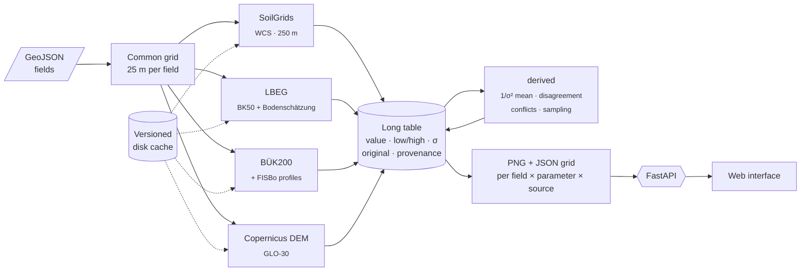

<div align="center">

[🇪🇸 Español](README.md) · **🇬🇧 English**

# 🌱 Tunen Challenge Solution - Madrid Open Vol. 1

**A single API for every German soil data source, with honest uncertainty,
and an interface that paints them field by field.**

[](#-context)

[](https://www.python.org/)
[](https://fastapi.tiangolo.com/)
[](https://docs.pydantic.dev/)
[](https://numpy.org/)
[](https://shapely.readthedocs.io/)
[](https://rasterio.readthedocs.io/)
[](https://matplotlib.org/)
<br>
[](https://leafletjs.com/)
[](static/js)
[](tests/ui/README.md)
[](#-how-to-run-it)
[](LICENSE)

[**See the interface →**](docs/en/interface.md) · [Architecture](docs/en/architecture.md) · [Sources](docs/en/sources.md) · [API](#-api)

</div>

---

## 🏆 Context

This project was built during the **Madrid Open – Vol.1** hackathon, held on **3 October 2026** at
**Mad Tech Campus** (Madrid). We solved the challenge set by the company **Tunen** and **we were the
winning team**.

**Team:** Daniel Arias Suárez · Abraham Pozuelo Acedo · Pablo Grano de Oro Sevillano

> [!NOTE]
> The demo starts locally with no keys and no network: every data-source response for the example farm
> is cached and versioned in the repository.

## 🎯 The challenge

In Germany, soil information is spread across several bodies: global models (SoilGrids), state services
(LBEG in Lower Saxony) and national maps (BGR). Each one has its own resolution, coverage, units and,
sometimes, its own classes. Tunen asked for:

- a **backend that unifies those sources behind a single API**: it receives fields as GeoJSON and returns
  one layer per **field × parameter × source**;
- five agronomic topsoil parameters: **texture, pH, organic carbon, plant-available water (nFK) and Bodenzahl**;
- an **interface that consumes only that API** and paints the data over the fields of a real farm.

The full brief, scope and judging criteria are in [docs/en/challenge.md](docs/en/challenge.md).

## 🗺️ The result

**LuF Seggerde**: 87 active fields on both sides of the border between **Lower Saxony** and **Saxony-Anhalt**.
Each field is filled with a 25 m grid computed from five sources.

> The screenshots and GIFs in this repository were taken during the hackathon with the farm fields that
> Tunen shared with participants. The repository demo uses a
> [synthetic example farm](data/demo/example_farm.geojson) instead: 12 made-up fields drawn over
> agricultural plots near Vienenburg, also on both sides of the border (6 in Lower Saxony and 6 in Saxony-Anhalt).

<p align="center">
  
</p>

<p align="center">
  
</p>

<p align="center"><a href="docs/en/interface.md"><b>🎬 Full walkthrough of the interface, with GIFs →</b></a></p>

## 🧩 The solution



- **One adapter per source.** Each one converts its response into a common language: value in the
  parameter's unit, `low`/`high` interval, uncertainty `σ`, original value and provenance. Adding a source
  means adding a file in [`app/sources/`](app/sources).
- **German classes → numbers with a range.** KA5 and Bodenschätzung classes are translated with
  deterministic tables in [`lookups/`](lookups). No model is used at query time.
- **`derived` is just another source**: it combines the others with a `1/σ²` weighted mean and computes
  the disagreement between sources, physical conflicts and sampling priority.
- **Explicit reliability.** If SoilGrids says there is 14 % clay and the official Bodenschätzung says that
  soil cannot exceed 10 % fine particles, it is flagged as a **physical contradiction** and that point is
  proposed for sampling.
- **Robust against unstable services.** LBEG returns errors inside HTTP 200 responses: bodies are
  validated, and retries, a circuit breaker and a disk cache that never stores errors are applied.

| Source | Coverage | Provides |
|---|---|---|
| 🌍 **ISRIC SoilGrids 2.0** | Global · 250 m | clay, sand, silt, pH (water), organic carbon, nFK |
| 🏛️ **LBEG NIBIS** (BK50 + Bodenschätzung) | Lower Saxony only · 1:5,000–1:50,000 | **Bodenzahl**, Ackerzahl, official class, nFK, soil type |
| 🇩🇪 **BGR BÜK200** + FISBo profiles | All of Germany · 1:200,000 | clay, sand, silt, organic carbon, pH (CaCl₂) |
| 🏔️ **Copernicus DEM GLO-30** | Global · 30 m | elevation, slope, aspect, hillshade |
| 🧮 **derived** | Wherever any source exists | weighted mean, disagreement, conflicts, sampling priority |

More detail: [architecture](docs/en/architecture.md) · [coverage matrix](docs/en/coverage_matrix.md) ·
[verified facts about each source](docs/en/sources.md).

> [!NOTE]
> **Glossary of German terms**: *Bodenzahl* / *Ackerzahl* — official 0–100 soil quality scores from the
> German soil assessment (*Bodenschätzung*); *nFK* — plant-available water capacity; *KA5* — German soil
> mapping guideline (classes for texture, humus, acidity); *Bodenart* — soil texture class;
> *Niedersachsen* — Lower Saxony; *Sachsen-Anhalt* — Saxony-Anhalt; *Land / Länder* — German federal state(s).

## 🚀 How to run it

Requires **Python 3.12**.

```powershell
python -m venv .venv
.venv\Scripts\python -m pip install -r requirements.txt
.venv\Scripts\python -m uvicorn app.main:app --port 8000
```

Then:

1. Open **<http://localhost:8000>** and click **Try the example farm** (or drop your own GeoJSON).
   With `FIELDS_GEOJSON=<path>` another farm is used as the example; if there is none, only upload remains.
2. Interactive API docs (Swagger): **<http://localhost:8000/docs>**.

> [!TIP]
> On Linux/macOS, replace `.venv\Scripts\python` with `.venv/bin/python`.
> The terrain module is disabled with the environment variable `ENABLE_TERRAIN=0`.

<details>
<summary><b>CLI</b></summary>

```powershell
.venv\Scripts\python -m app.cli test Lerchenbreite "Großer Schlag"   # summary per source and parameter + long-table CSV
.venv\Scripts\python -m app.cli warm my_farm.geojson                   # pre-warms the cache (retries LBEG errors)
.venv\Scripts\python -m app.cli refresh --source lbeg             # clears one source's cache and recomputes
```

</details>

<details>
<summary><b>Tests</b></summary>

```powershell
.venv\Scripts\python tests\test_terrain.py                        # terrain module, no network or browser

.venv\Scripts\python -m pip install -r requirements-dev.txt
.venv\Scripts\python -m playwright install chromium
.venv\Scripts\python tests\ui\check_recorrido_demo.py             # full walkthrough of the interface
```

List of interface checks in [tests/ui/README.md](tests/ui/README.md) (Spanish).

</details>

## 🔌 API

| Method | Path | Returns |
|---|---|---|
| `POST` | `/soil/layers` | Layers for the submitted fields: `{"fields": FeatureCollection, "parameters"?: [...], "sources"?: [...]}` |
| `GET` | `/soil/demo` | The same for the example farm, plus the featured fields |
| `GET` | `/soil/fields/{id}/points` | Every value per point and source, with its uncertainty |
| `GET` | `/soil/fields/{id}/sampling?k=` | Suggested sampling points and the reason |
| `GET` | `/sources` | Source matrix: parameters, coverage, resolution and method |
| `GET` | `/parameters` | Unit, colormap and description of each parameter |
| `POST` / `GET` | `/refresh` | Clears the cache (one source or all), recomputes in the background and reports status |

```powershell
curl -X POST http://localhost:8000/soil/layers -H "Content-Type: application/json" `
     -d '{"fields": <FeatureCollection>, "parameters": ["clay", "bodenzahl"], "sources": ["lbeg", "derived"]}'
```

<details>
<summary><b>Response (abridged)</b></summary>

```json
{
  "fields": [{
    "field_id": "…", "name": "Lerchenbreite", "area_ha": 6.1, "state": "Lower Saxony",
    "reliability_index": 19, "sampling": [{ "rank": 1, "reason": "Sources disagree by 27.9 silt points", "…": "…" }],
    "layers": [{
      "parameter": "clay", "source": "derived", "unit": "%", "status": "ok",
      "png_url": "/renders/<field_id>/derived_clay.png", "grid_url": "/renders/<field_id>/derived_clay.json",
      "stats": { "min": "…", "mean": "…", "max": "…", "coverage_pct": 100.0 },
      "colormap": { "name": "YlOrBr", "min": 0, "max": 60 },
      "provenance": { "source": "…", "detail": "…" }
    }]
  }]
}
```

Layers without data are also returned, with `status: "no_coverage"` or `"error"` and a `message` explaining
why (for example, "LBEG only covers Niedersachsen"). Full model in
[docs/en/architecture.md](docs/en/architecture.md#api).

</details>

## 🖥️ Interface

<p align="center">
  
</p>

A build-free web application (HTML + ES modules + Leaflet) that only talks to the API:

| | |
|---|---|
| 🗺️ **Farm and field** over satellite imagery, with 6 soil layers and 3 terrain layers | 🧱 **Isometric stack** of the layers, clipped to the real field outline |
| 🔀 **Source switching** on each layer: Combined, SoilGrids, LBEG or BÜK200 | 🔍 **Per-point inspector** with every source, the classes and the conflicts |
| 🌡️ **Uncertainty map** and 📍 reasoned **sampling points** | 🧪 **Texture breakdown** in three synchronised panels |
| ⛰️ **Hillshade** and 📈 **elevation profile** with the Bodenzahl along the line | ⌨️ **Keyboard shortcuts** for the whole demo |

<p align="center"><a href="docs/en/interface.md"><b>See every feature with GIFs →</b></a></p>

## 📁 Project structure

```
.
├── app/                 FastAPI API
│   ├── sources/         one adapter per source (soilgrids, lbeg, buek200, copernicus_dem, derived)
│   ├── fields.py        common 25 m grid per field
│   ├── analysis.py      reliability, conflicts and sampling points
│   ├── render.py        PNG + JSON grid per layer
│   ├── cache.py         disk cache for every external call
│   └── main.py          endpoints
├── lookups/             translation tables from German classes (KA5, Bodenschätzung) to numbers with a range
├── static/              web interface (HTML + ES modules + Leaflet)
├── data/demo/           synthetic example farm and cache/ with its responses (data/cache/ is local)
├── tests/               terrain module test and Playwright interface checks (tests/ui)
├── docs/                challenge, architecture, sources, coverage matrix and interface (docs/en/ in English)
└── exploracion/         early experiments and evidence gathering for each source
```

## 📚 Documentation

| Document | Contents |
|---|---|
| 🖥️ [**Interface**](docs/en/interface.md) | Visual walkthrough of every feature, with GIFs |
| 🎯 [Challenge](docs/en/challenge.md) | Brief, scope, judging criteria and what was covered |
| 🏗️ [Architecture](docs/en/architecture.md) | Pipeline, long table, adapters, cache, reliability and API |
| 🧭 [Coverage matrix](docs/en/coverage_matrix.md) | Parameter × source and how each one is translated |
| 🔬 [Sources](docs/en/sources.md) | Verified facts about each source: attributes, units, latencies and issues |
| 🧪 [Exploration](exploracion/README.en.md) | How we got here |

## 👥 Authors

| | |
|---|---|
| **Daniel Arias Suárez** | 🏆 Winner of the Tunen challenge · Madrid Open Vol.1 |
| **Abraham Pozuelo Acedo** | 🏆 Winner of the Tunen challenge · Madrid Open Vol.1 |
| **Pablo Grano de Oro Sevillano** | 🏆 Winner of the Tunen challenge · Madrid Open Vol.1 |

## 📄 License

Distributed under the [MIT](LICENSE) license © 2026 Daniel Arias Suárez, Abraham Pozuelo Acedo and Pablo Grano de Oro Sevillano.

The data queried by the API belongs to its authors: ISRIC (SoilGrids, CC BY 4.0), LBEG (NIBIS), BGR
(BÜK200) and Copernicus (DEM GLO-30). The satellite imagery in the interface is from Esri World Imagery.
