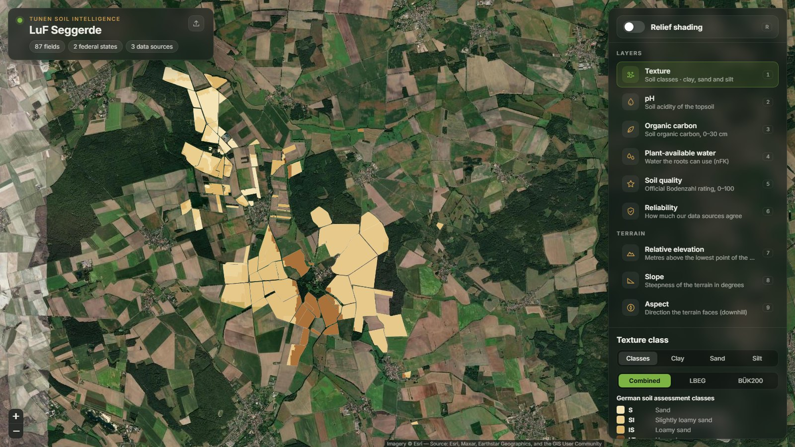
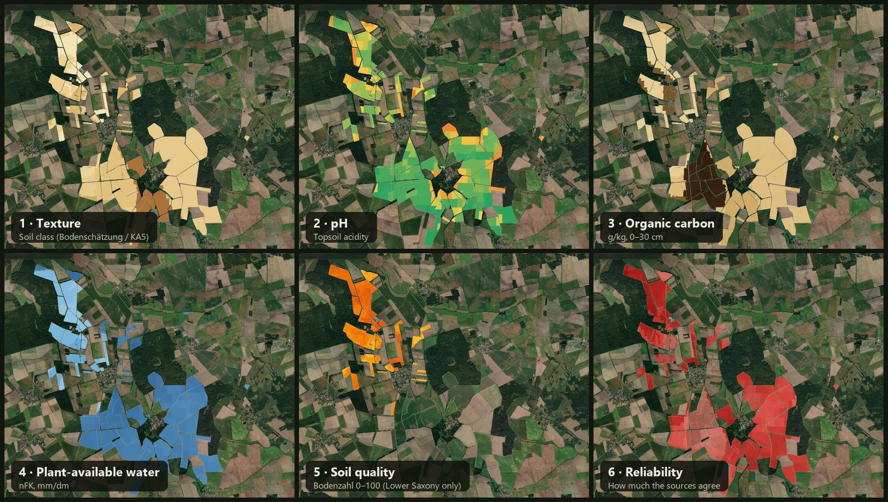
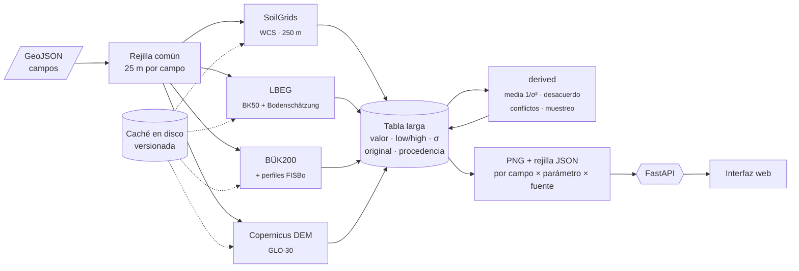
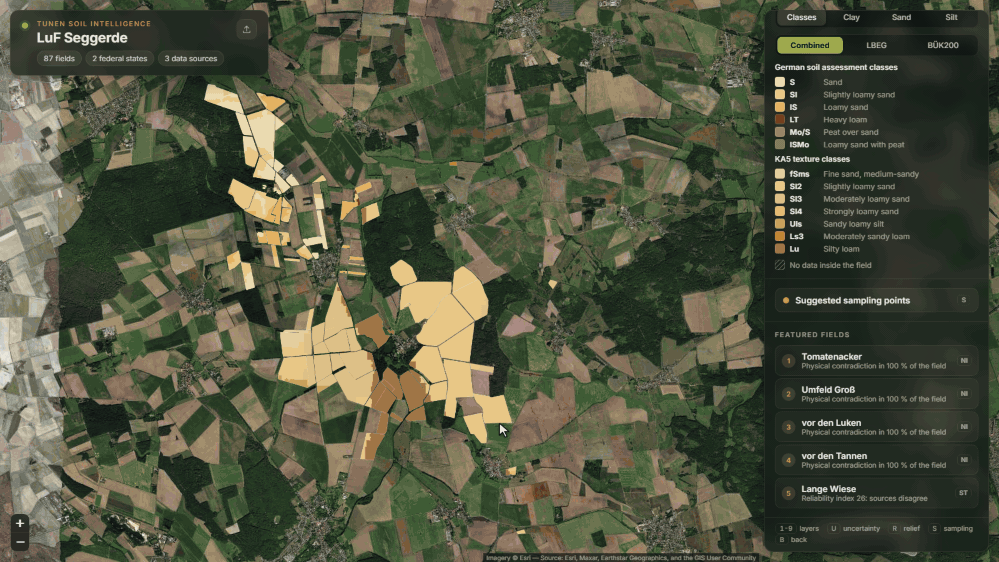

<div align="center">

# 🌱 Tunen Soil Aggregation API

**Una sola API para todas las fuentes de datos de suelo alemanas, con incertidumbre honesta,
y una interfaz que las pinta campo a campo.**

[](#-contexto)

[](https://www.python.org/)
[](https://fastapi.tiangolo.com/)
[](https://docs.pydantic.dev/)
[](https://numpy.org/)
[](https://shapely.readthedocs.io/)
[](https://rasterio.readthedocs.io/)
[](https://matplotlib.org/)
<br>
[](https://leafletjs.com/)
[](static/js)
[](tests/ui/README.md)
[](#-cómo-ejecutarlo)
[](LICENSE)

[**Ver la interfaz →**](docs/interfaz.md) · [Arquitectura](docs/arquitectura.md) · [Fuentes](docs/fuentes.md) · [API](#-api)

</div>

---

## 🏆 Contexto

Este proyecto se construyó durante el hackathon **Madrid Open – Vol.1**, celebrado el
**3 de octubre de 2026** en el **Mad Tech Campus** (Madrid). Resolvimos el reto propuesto por la empresa
**Tunen** y **fuimos el equipo ganador**.

**Equipo:** Daniel Arias Suárez · Abraham Pozuelo Acedo · Pablo Grano de Oro Sevillano

> [!NOTE]
> La demo arranca en local sin claves ni red: todas las respuestas de las fuentes de datos para la granja
> de ejemplo están en caché y versionadas en el repositorio.

## 🎯 El reto

En Alemania la información de suelo está repartida en varios organismos: modelos globales (SoilGrids),
servicios de cada Land (LBEG en Baja Sajonia) y mapas nacionales (BGR). Cada uno tiene su resolución, su
cobertura, sus unidades y, a veces, sus propias clases. Tunen planteó:

- un **backend que unifique esas fuentes detrás de una sola API**: recibe campos en GeoJSON y devuelve
  una capa por **campo × parámetro × fuente**;
- cinco parámetros agronómicos del topsoil: **textura, pH, carbono orgánico, agua útil (nFK) y Bodenzahl**;
- una **interfaz que consume solo esa API** y pinta los datos sobre los campos de una granja real.

El enunciado completo, el alcance y los criterios del jurado están en [docs/reto.md](docs/reto.md).

## 🗺️ El resultado

**LuF Seggerde**: 87 campos activos a ambos lados de la frontera entre **Baja Sajonia** y **Sajonia-Anhalt**.
Cada campo se rellena con una rejilla de 25 m calculada a partir de cinco fuentes.

> [!IMPORTANT]
> Las capturas y los GIFs de este repositorio se hicieron durante el hackathon con los campos de una granja real
> que Tunen compartió con los participantes. **Ese dataset no se publica**: ni el GeoJSON ni nada derivado de él
> (respuestas de las fuentes, polígonos o puntos). La demo del repositorio usa en su lugar una
> [granja de ejemplo sintética](data/demo/example_farm.geojson): 12 campos inventados, dibujados sobre parcelas
> agrícolas cerca de Vienenburg, también a ambos lados de la frontera (6 en Baja Sajonia y 6 en Sajonia-Anhalt).

<p align="center">
  
</p>

<p align="center">
  
</p>

<p align="center"><a href="docs/interfaz.md"><b>🎬 Recorrido completo de la interfaz, con GIFs →</b></a></p>

## 🧩 La solución



- **Un adaptador por fuente.** Cada uno convierte su respuesta a un idioma común: valor en la unidad del
  parámetro, intervalo `low`/`high`, incertidumbre `σ`, valor original y procedencia. Añadir una fuente es
  añadir un fichero en [`app/sources/`](app/sources).
- **Clases alemanas → números con rango.** Las clases KA5 y de la Bodenschätzung se traducen con tablas
  deterministas en [`lookups/`](lookups). No se usa ningún modelo en el momento de la consulta.
- **`derived` es una fuente más**: combina las demás con una media ponderada por `1/σ²` y calcula el
  desacuerdo entre fuentes, los conflictos físicos y la prioridad de muestreo.
- **Fiabilidad explícita.** Si SoilGrids dice que hay 14 % de arcilla y la Bodenschätzung oficial dice
  que ese suelo no puede pasar del 10 % de partículas finas, se marca como **contradicción física** y ese
  punto se propone para muestreo.
- **Robusto ante servicios inestables.** LBEG devuelve errores dentro de respuestas HTTP 200: se validan
  los cuerpos y se aplican reintentos, un cortacircuitos y una caché en disco que nunca guarda errores.

| Fuente | Cobertura | Aporta |
|---|---|---|
| 🌍 **ISRIC SoilGrids 2.0** | Global · 250 m | arcilla, arena, limo, pH (agua), carbono orgánico, nFK |
| 🏛️ **LBEG NIBIS** (BK50 + Bodenschätzung) | Solo Baja Sajonia · 1:5.000–1:50.000 | **Bodenzahl**, Ackerzahl, clase oficial, nFK, tipo de suelo |
| 🇩🇪 **BGR BÜK200** + perfiles FISBo | Toda Alemania · 1:200.000 | arcilla, arena, limo, carbono orgánico, pH (CaCl₂) |
| 🏔️ **Copernicus DEM GLO-30** | Global · 30 m | altitud, pendiente, orientación, relieve sombreado |
| 🧮 **derived** | Donde haya alguna fuente | media ponderada, desacuerdo, conflictos, prioridad de muestreo |

Más detalle: [arquitectura](docs/arquitectura.md) · [matriz de cobertura](docs/matriz_cobertura.md) ·
[hechos verificados de cada fuente](docs/fuentes.md).

## 🚀 Cómo ejecutarlo

Requiere **Python 3.12**.

```powershell
python -m venv .venv
.venv\Scripts\python -m pip install -r requirements.txt
.venv\Scripts\python -m uvicorn app.main:app --port 8000
```

Después:

1. Abrir **<http://localhost:8000>** y pulsar **Try the example farm** (o arrastrar un GeoJSON propio).
   Con `FIELDS_GEOJSON=<ruta>` se usa otra granja como ejemplo; si no hay ninguna, solo queda la subida.
2. Documentación interactiva de la API (Swagger): **<http://localhost:8000/docs>**.

> [!TIP]
> En Linux/macOS, sustituir `.venv\Scripts\python` por `.venv/bin/python`.
> El módulo de terreno se desactiva con la variable de entorno `ENABLE_TERRAIN=0`.

<details>
<summary><b>CLI</b></summary>

```powershell
.venv\Scripts\python -m app.cli test Lerchenbreite "Großer Schlag"   # resumen por fuente y parámetro + CSV de la tabla larga
.venv\Scripts\python -m app.cli warm mi_granja.geojson                 # precarga la caché (reintenta los errores de LBEG)
.venv\Scripts\python -m app.cli refresh --source lbeg             # vacía la caché de una fuente y recalcula
```

</details>

<details>
<summary><b>Tests</b></summary>

```powershell
.venv\Scripts\python tests\test_terrain.py                        # módulo de terreno, sin red ni navegador

.venv\Scripts\python -m pip install -r requirements-dev.txt
.venv\Scripts\python -m playwright install chromium
.venv\Scripts\python tests\ui\check_recorrido_demo.py             # recorrido completo de la interfaz
```

Lista de comprobaciones de la interfaz en [tests/ui/README.md](tests/ui/README.md).

</details>

## 🔌 API

| Método | Ruta | Qué devuelve |
|---|---|---|
| `POST` | `/soil/layers` | Capas de los campos enviados: `{"fields": FeatureCollection, "parameters"?: [...], "sources"?: [...]}` |
| `GET` | `/soil/demo` | Lo mismo para la granja de ejemplo, más los campos destacados |
| `GET` | `/soil/fields/{id}/points` | Todos los valores por punto y fuente, con su incertidumbre |
| `GET` | `/soil/fields/{id}/sampling?k=` | Puntos de muestreo sugeridos y el motivo |
| `GET` | `/sources` | Matriz de fuentes: parámetros, cobertura, resolución y método |
| `GET` | `/parameters` | Unidad, colormap y descripción de cada parámetro |
| `POST` / `GET` | `/refresh` | Vacía la caché (de una fuente o de todas), recalcula en segundo plano y consulta el estado |

```powershell
curl -X POST http://localhost:8000/soil/layers -H "Content-Type: application/json" `
     -d '{"fields": <FeatureCollection>, "parameters": ["clay", "bodenzahl"], "sources": ["lbeg", "derived"]}'
```

<details>
<summary><b>Respuesta (abreviada)</b></summary>

```json
{
  "fields": [{
    "field_id": "…", "name": "Lerchenbreite", "area_ha": 6.1, "state": "Lower Saxony",
    "reliability_index": 19, "sampling": [{ "rank": 1, "reason": "Sources disagree by 27.9 silt points", "…": "…" }],
    "layers": [{
      "parameter": "clay", "source": "derived", "unit": "%", "status": "ok",
      "png_url": "/renders/<field_id>/derived_clay.png", "grid_url": "/renders/<field_id>/derived_clay.json",
      "stats": { "min": "…", "mean": "…", "max": "…", "coverage_pct": 100.0 },
      "colormap": { "name": "YlOrBr", "min": 0, "max": 60 },
      "provenance": { "source": "…", "detail": "…" }
    }]
  }]
}
```

Las capas sin dato también se devuelven, con `status: "no_coverage"` o `"error"` y un `message` que explica
el motivo (por ejemplo, "LBEG solo cubre Niedersachsen"). Modelo completo en
[docs/arquitectura.md](docs/arquitectura.md#api).

</details>

## 🖥️ Interfaz

<p align="center">
  
</p>

Una aplicación web sin compilación (HTML + módulos ES + Leaflet) que solo habla con la API:

| | |
|---|---|
| 🗺️ **Granja y campo** sobre satélite, con 6 capas de suelo y 3 de terreno | 🧱 **Pila isométrica** de las capas, recortadas con la silueta real del campo |
| 🔀 **Cambio de fuente** en cada capa: Combined, SoilGrids, LBEG o BÜK200 | 🔍 **Inspector por punto** con todas las fuentes, las clases y los conflictos |
| 🌡️ **Mapa de incertidumbre** y 📍 **puntos de muestreo** razonados | 🧪 **Desglose de textura** en tres paneles sincronizados |
| ⛰️ **Relieve sombreado** y 📈 **perfil altimétrico** con la Bodenzahl a lo largo de la línea | ⌨️ **Atajos de teclado** para toda la demo |

<p align="center"><a href="docs/interfaz.md"><b>Ver todas las funcionalidades con GIFs →</b></a></p>

## 📁 Estructura del proyecto

```
.
├── app/                 API FastAPI
│   ├── sources/         un adaptador por fuente (soilgrids, lbeg, buek200, copernicus_dem, derived)
│   ├── fields.py        rejilla común de 25 m por campo
│   ├── analysis.py      fiabilidad, conflictos y puntos de muestreo
│   ├── render.py        PNG + rejilla JSON por capa
│   ├── cache.py         caché en disco de todas las llamadas externas
│   └── main.py          endpoints
├── lookups/             tablas de traducción de clases alemanas (KA5, Bodenschätzung) a números con rango
├── static/              interfaz web (HTML + módulos ES + Leaflet)
├── data/demo/           granja de ejemplo sintética y cache/ con sus respuestas (data/cache/ es local)
├── tests/               test del módulo de terreno y comprobaciones de la interfaz con Playwright (tests/ui)
├── docs/                reto, arquitectura, fuentes, matriz de cobertura e interfaz
└── exploracion/         pruebas iniciales y recogida de evidencia de cada fuente
```

## 📚 Documentación

| Documento | Contenido |
|---|---|
| 🖥️ [**Interfaz**](docs/interfaz.md) | Recorrido visual por todas las funcionalidades, con GIFs |
| 🎯 [Reto](docs/reto.md) | Enunciado, alcance, criterios del jurado y qué se cubrió |
| 🏗️ [Arquitectura](docs/arquitectura.md) | Pipeline, tabla larga, adaptadores, caché, fiabilidad y API |
| 🧭 [Matriz de cobertura](docs/matriz_cobertura.md) | Parámetro × fuente y cómo se traduce cada uno |
| 🔬 [Fuentes](docs/fuentes.md) | Hechos verificados de cada fuente: atributos, unidades, latencias y problemas |
| 🧪 [Exploración](exploracion/README.md) | Cómo llegamos hasta aquí |

## 👥 Autores

| | |
|---|---|
| **Daniel Arias Suárez** | 🏆 Ganador del reto Tunen · Madrid Open Vol.1 |
| **Abraham Pozuelo Acedo** | 🏆 Ganador del reto Tunen · Madrid Open Vol.1 |
| **Pablo Grano de Oro Sevillano** | 🏆 Ganador del reto Tunen · Madrid Open Vol.1 |

## 📄 Licencia

Distribuido bajo licencia [MIT](LICENSE) © 2026 Daniel Arias Suárez, Abraham Pozuelo Acedo y Pablo Grano de Oro Sevillano.

Los datos que consulta la API pertenecen a sus autores: ISRIC (SoilGrids, CC BY 4.0), LBEG (NIBIS), BGR
(BÜK200) y Copernicus (DEM GLO-30). Las imágenes de satélite de la interfaz son de Esri World Imagery.
