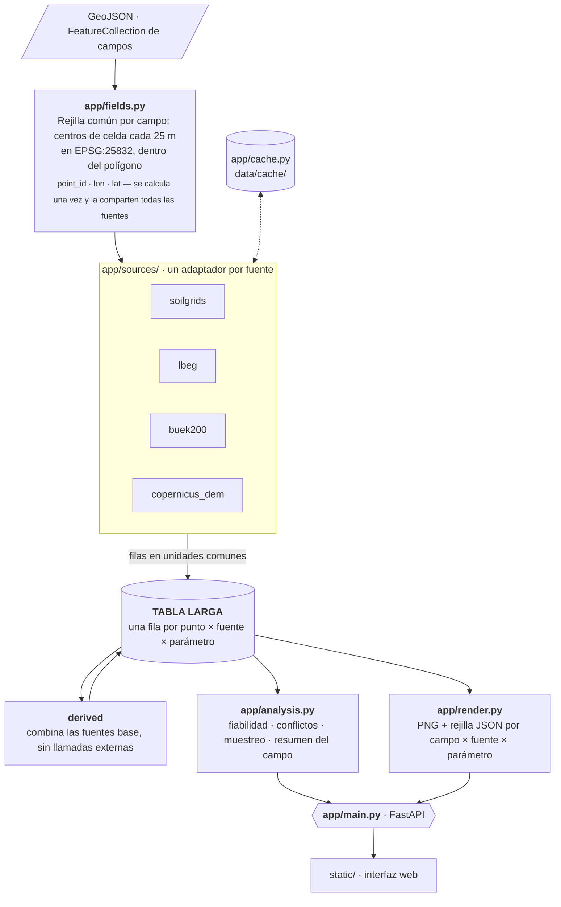
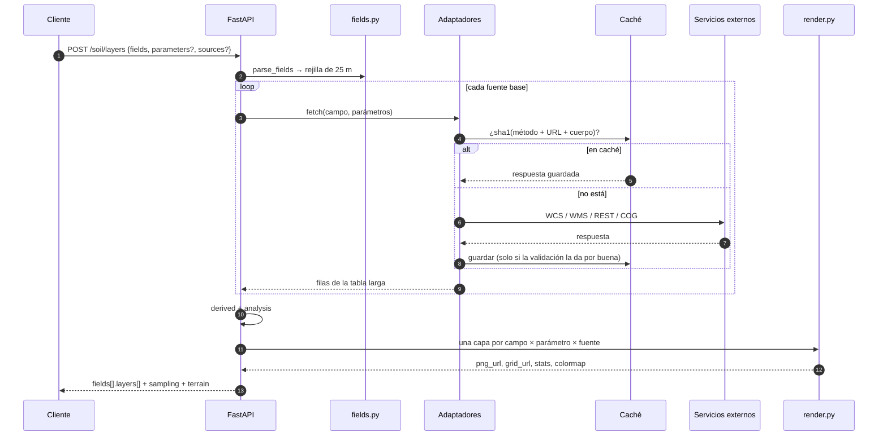
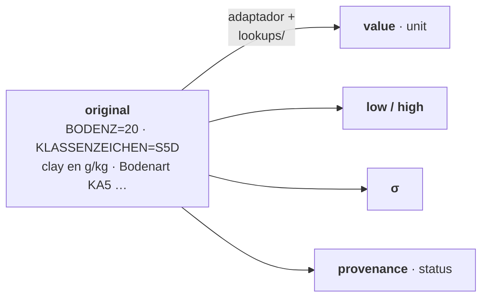
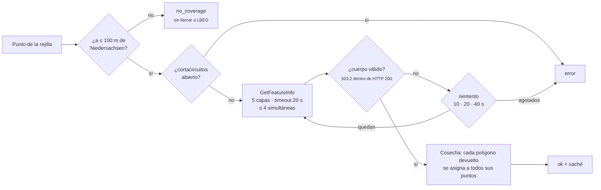

# Arquitectura

## Pipeline



Todo lo que viene de una API externa pasa por la caché en disco (`app/cache.py`).

### Una petición a `/soil/layers`



## Tabla larga

Una fila por punto, fuente y parámetro (`app/sources/base.py`):

```
field_id | point_id | lon | lat | source | parameter | value | unit | low | high | sigma | original | status | provenance
```

- `value`, `unit`: ya en la unidad común del parámetro (`app/config.py`, `PARAMETERS`).
- `low` / `high`: intervalo de confianza (cuantiles 5/95 % en SoilGrids; límites de la clase en las fuentes
  categóricas).
- `sigma`: incertidumbre en la unidad común; es el peso que usa `derived`.
- `original`: lo que devolvió la fuente, sin tocar (trazabilidad).
- `status`: `ok` | `no_coverage` | `error`. `provenance`: capa, atributo o fórmula de la que sale el valor.

`python -m app.cli test <campo>` guarda la tabla larga de un campo en `data/out/<campo>.csv`.



## Adaptadores

Cada fuente es una clase con `name`, `title`, `parameters`, `coverage`, `resolution`, `notes` y
`fetch(field, parameters) -> list[fila]`, registrada con `@register_source`. Añadir una fuente es añadir un
fichero en `app/sources/` y su import en `app/sources/__init__.py`.

| Adaptador | Cómo obtiene los datos | Traducción |
|---|---|---|
| `soilgrids` | WCS 2.0.1 de ISRIC: GeoTIFF de la caja del campo para 7 propiedades × 3 profundidades × media/Q05/Q95; respaldo por VRT | 0–30 cm ponderado por grosor; σ = (Q95 − Q05)/3,29; nFK = wv0033 − wv1500; −32768 y valores imposibles = sin cobertura |
| `lbeg` | Una sola llamada WMS GetFeatureInfo con 5 capas (BK50 L816/L839/L823/L837 + Bodenschätzung L849); cada polígono devuelto se asigna a todos los puntos que contiene ("cosecha") | nFK = NFKWE / (WE/10); Bodenzahl/Ackerzahl directos; Bodenart de la Bodenschätzung → rango de partículas finas |
| `buek200` | ArcGIS REST: hoja → unidad de leyenda → ficha de perfiles FISBo | Clases KA5 (`lookups/`) del horizonte 0–3 dm de los perfiles de uso agrícola, ponderadas por Flächenanteil |
| `copernicus_dem` | STAC de Earth Search → COG en S3; una sola lectura por petición para todos los campos | Altitud, altitud relativa, pendiente, orientación, relieve sombreado |
| `derived` | Las filas de las demás fuentes | Media ponderada por 1/σ²; σ del modelo = 1/√Σw; desacuerdo = máx − mín; `clay_conflict` |

Detalles de cada fuente (atributos exactos, unidades, latencias, errores) en [fuentes.md](fuentes.md) y la
matriz completa en [matriz_cobertura.md](matriz_cobertura.md).

### Reglas de traducción deterministas

Las clases alemanas se convierten en números con rango mediante tablas fijas en `lookups/`:

| Tabla | Convierte |
|---|---|
| `ka5_bodenart.csv` (+ `ka5_bodenart_alias.csv`) | Bodenart KA5 (Sl2, Ls4, …) → centroide de arcilla/limo/arena y rangos |
| `ka5_humus.csv` | Clase de humus h0–h7 → % de materia orgánica (→ carbono orgánico con el factor 1,72) |
| `ka5_acidez.csv` | Clase de acidez KA5 → rango de pH (CaCl₂) |
| `bodenschaetzung_feinanteil.csv` | Bodenart de la Bodenschätzung (S, Sl, lS, …) → rango de partículas < 0,01 mm |

Las tablas se construyeron a partir de las respuestas reales de las fuentes (`exploracion/evidencia/`) y la
documentación oficial (KA5, NIBIS), y se revisaron a mano. Ningún modelo traduce valores en tiempo de consulta.

### Cómo combina `derived`

Para cada punto y parámetro, con las fuentes $i$ que tienen dato:

$$
\hat{x} = \frac{\sum_i w_i\,x_i}{\sum_i w_i}, \qquad w_i = \frac{1}{\sigma_i^2}, \qquad
\sigma_{\text{modelo}} = \frac{1}{\sqrt{\sum_i w_i}}, \qquad
\text{desacuerdo} = \max_i x_i - \min_i x_i
$$

Una fuente precisa (σ pequeña) pesa más que una vaga. Arcilla, arena y limo se normalizan después para que
sumen 100 %.

### LBEG: robustez




LBEG responde en ~0,15 s pero tiene cuelgues de 90 s, caídas y errores `503.2` **dentro de HTTP 200**. El
adaptador inspecciona el cuerpo, usa timeout de 20 s, reintentos con espera (10/20/40 s), como máximo 4
peticiones simultáneas y un cortacircuitos tras 3 fallos seguidos. Los puntos a más de 100 m de
Niedersachsen (límite oficial BKG VG250, `app/regions.py`) se marcan `no_coverage` sin llamar a LBEG.

## Fiabilidad y muestreo (`app/analysis.py`)

- `ka5_class` (buek200): clase KA5 dominante de la unidad BÜK200.
- `<p>_sigma` (derived): σ del modelo de la media combinada, como capa.
- `sampling_priority` (derived, 0–1): media de `min(1, desacuerdo/ref)` de arcilla, arena, limo, carbono
  orgánico y nFK, más `clay_conflict` como un componente más. La interfaz muestra
  `reliability_index = 100 · (1 − prioridad)`.
- `clay_conflict`: la arcilla de SoilGrids supera el máximo de partículas finas que admite la clase de la
  Bodenschätzung en ese punto (físicamente imposible).
- `acker_delta` (con el módulo de terreno): Ackerzahl − Bodenzahl.
- Puntos de muestreo: los de mayor prioridad, separados al menos 75 m, con el motivo en texto.
- Campos destacados de la demo: el más interesante de cada Land y después los de mayor desacuerdo o conflicto.

## Caché

- Clave = sha1(método + URL + cuerpo); fichero `data/cache/<fuente>/<clave>.bin` + `.json` con URL, fecha y
  Content-Type.
- Solo se guarda lo que la validación da por bueno (un 503.2 nunca entra en caché).
- Si está en caché no se toca la red. Se busca primero en `data/cache/` (local, no versionada) y después en
  `data/demo/cache/` (versionada, solo lectura, con las respuestas de la granja de ejemplo): la demo funciona
  sin conexión.
- `/refresh` no borra: mueve la caché a `data/cache/_stale/<fuente>` y, si al recalcular una llamada falla,
  reutiliza la versión anterior.

## API

| Método | Ruta | Descripción |
|---|---|---|
| `POST` | `/soil/layers` | `{"fields": FeatureCollection, "parameters"?: [...], "sources"?: [...]}` → capas por campo |
| `GET` | `/soil/demo` | `/soil/layers` sobre la granja de ejemplo (`data/demo/example_farm.geojson` o `FIELDS_GEOJSON`) + `name` + `featured`. Se guarda en `data/out/`; `?refresh=true` lo rehace |
| `GET` | `/soil/fields/{id}/points` | Por punto: `values[param][source]`, `uncertainty[param] = {spread, sigma}`, clases, conflicto y fiabilidad |
| `GET` | `/soil/fields/{id}/sampling?k=` | Puntos de muestreo con prioridad y motivo |
| `GET` | `/sources` | Matriz de fuentes |
| `GET` | `/parameters` | Unidad, colormap (nombre, mín., máx.) y descripción |
| `POST` | `/refresh` | `{"source"?: X, "fields"?: FeatureCollection}`: vacía la caché y recalcula en segundo plano |
| `GET` | `/refresh` | Estado del último refresco |
| `GET` | `/legend/{cmap}.png` | Barra de color del colormap |

Respuesta de `/soil/layers` (abreviada):

```json
{
  "fields": [{
    "field_id": "…", "name": "Umfeld Groß", "area_ha": 12.3, "n_points": 197,
    "bounds": [[lat_s, lon_w], [lat_n, lon_e]], "geometry": { … },
    "state": "Lower Saxony", "sources": ["buek200", "lbeg", "soilgrids"],
    "reliability_index": 71, "conflict_share": 0.12,
    "sampling": [{ "rank": 1, "point_id": 22, "lon": …, "lat": …, "priority": 0.574, "reliability_index": 43,
                   "reason_parameter": "silt", "reason": "Sources disagree by 27.9 silt points" }],
    "terrain": { "elev_min": 73.4, "elev_max": 74.5, "local_relief": 1.1, "slope_mean": 0.6, "slope_p95": 2.3,
                 "dominant_aspect": "Flat", … },
    "layers": [{
      "parameter": "clay", "source": "derived", "unit": "%", "status": "ok",
      "png_url": "/renders/<field_id>/derived_clay.png?v=…", "grid_url": "/renders/<field_id>/derived_clay.json?v=…",
      "stats": { "min": …, "mean": …, "max": …, "coverage_pct": 100.0 }, "colormap": { "name": "YlOrBr", "min": 0, "max": 60 },
      "status_counts": { "ok": 197 }, "message": null,
      "provenance": { "source": "…", "detail": "…", "notes": "…", "resolution": "…" }
    }]
  }],
  "terrain_background": { "png_url": "…", "bounds": [[…], […]] }
}
```

Las capas sin dato (`no_coverage`, `error`) se devuelven igualmente, con `message` explicando por qué
(p. ej. "LBEG solo cubre Niedersachsen").

## Módulo de terreno

Copernicus DEM GLO-30 se activa por defecto y se desactiva con `ENABLE_TERRAIN=0`; apagado, no se registra la
fuente ni aparecen sus parámetros ni capas. El DEM es un modelo de superficie (incluye setos y árboles), por
eso la pendiente media y el p95 del resumen excluyen una franja de 40 m del borde del campo (salvo en campos
con menos de 10 puntos interiores). Las capas de terreno no entran en `derived` ni en la prioridad de muestreo.
