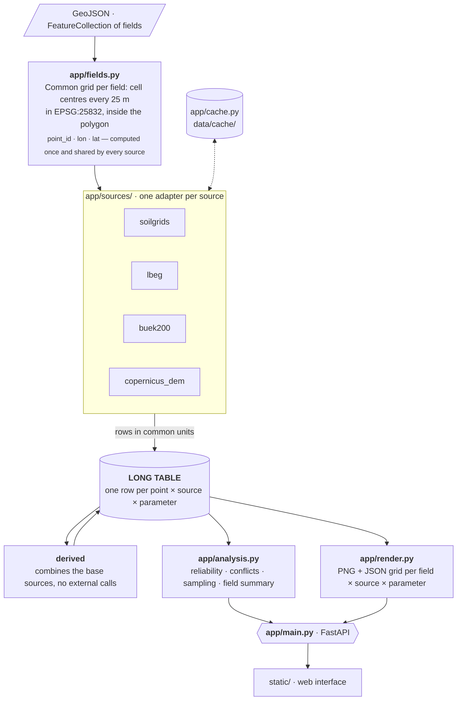
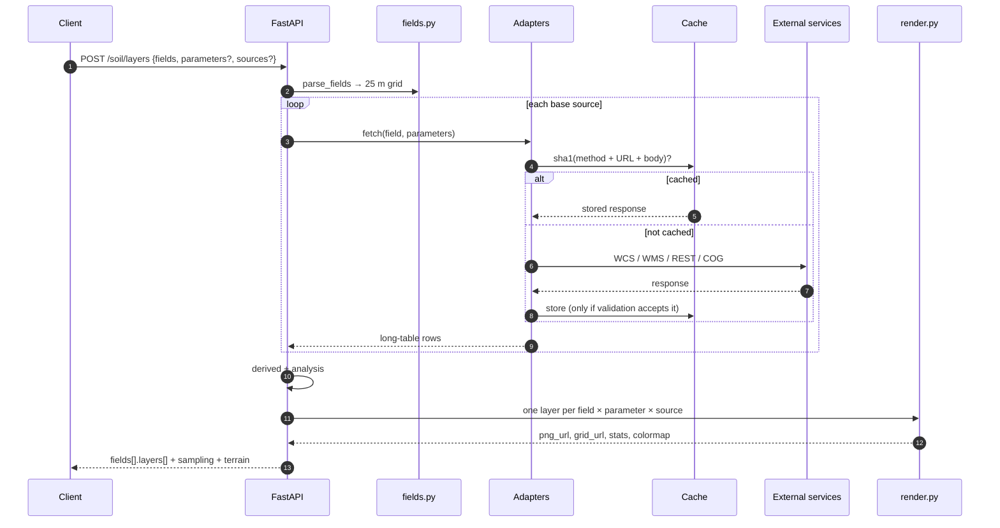
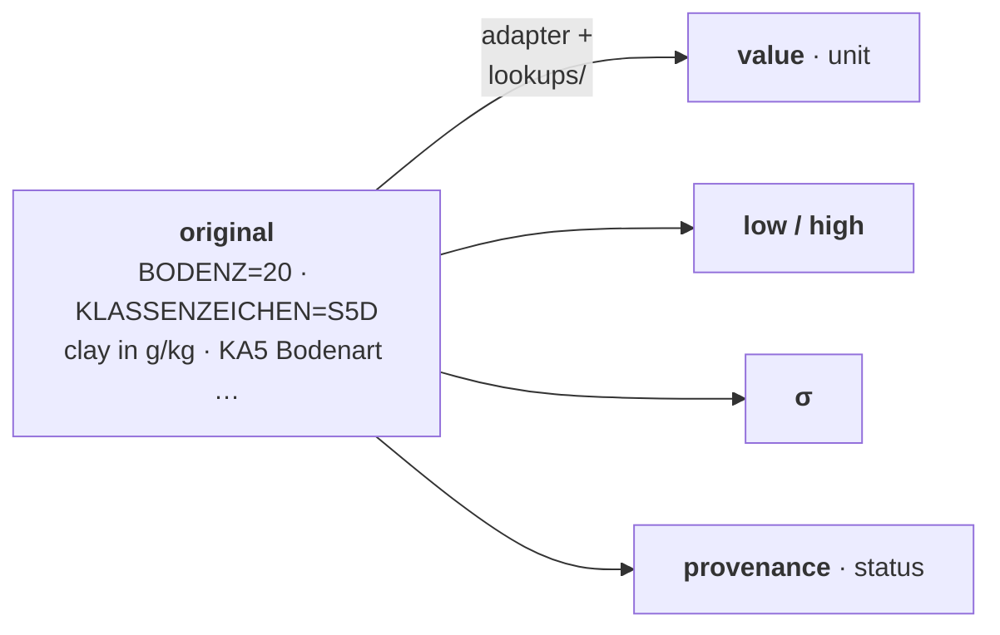
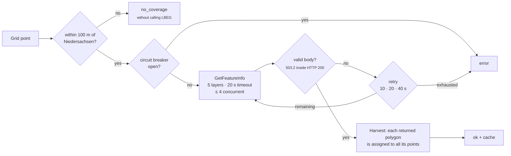

[🇪🇸 Español](../arquitectura.md) · **🇬🇧 English**

# Architecture

## Pipeline



Everything that comes from an external API goes through the disk cache (`app/cache.py`).

### A request to `/soil/layers`



## Long table

One row per point, source and parameter (`app/sources/base.py`):

```
field_id | point_id | lon | lat | source | parameter | value | unit | low | high | sigma | original | status | provenance
```

- `value`, `unit`: already in the parameter's common unit (`app/config.py`, `PARAMETERS`).
- `low` / `high`: confidence interval (5/95 % quantiles in SoilGrids; class limits for the categorical
  sources).
- `sigma`: uncertainty in the common unit; it is the weight used by `derived`.
- `original`: what the source returned, untouched (traceability).
- `status`: `ok` | `no_coverage` | `error`. `provenance`: layer, attribute or formula the value comes from.

`python -m app.cli test <field>` saves a field's long table to `data/out/<field>.csv`.



## Adapters

Each source is a class with `name`, `title`, `parameters`, `coverage`, `resolution`, `notes` and
`fetch(field, parameters) -> list[row]`, registered with `@register_source`. Adding a source means adding a
file in `app/sources/` and its import in `app/sources/__init__.py`.

| Adapter | How it gets the data | Translation |
|---|---|---|
| `soilgrids` | ISRIC WCS 2.0.1: GeoTIFF of the field's box for 7 properties × 3 depths × mean/Q05/Q95; VRT fallback | 0–30 cm weighted by thickness; σ = (Q95 − Q05)/3.29; nFK = wv0033 − wv1500; −32768 and impossible values = no coverage |
| `lbeg` | A single WMS GetFeatureInfo call with 5 layers (BK50 L816/L839/L823/L837 + Bodenschätzung L849); each returned polygon is assigned to every point it contains ("harvest") | nFK = NFKWE / (WE/10); Bodenzahl/Ackerzahl direct; Bodenschätzung Bodenart → fine-particle range |
| `buek200` | ArcGIS REST: sheet → legend unit → FISBo profile sheet | KA5 classes (`lookups/`) of the 0–3 dm horizon of agricultural-use profiles, weighted by Flächenanteil (area share) |
| `copernicus_dem` | Earth Search STAC → COG on S3; a single read per request for all fields | Elevation, relative elevation, slope, aspect, hillshade |
| `derived` | The rows of the other sources | 1/σ² weighted mean; model σ = 1/√Σw; disagreement = max − min; `clay_conflict` |

Details of each source (exact attributes, units, latencies, errors) in [sources.md](sources.md) and the
full matrix in [coverage_matrix.md](coverage_matrix.md).

### Deterministic translation rules

German classes are converted into numbers with a range using fixed tables in `lookups/`:

| Table | Converts |
|---|---|
| `ka5_bodenart.csv` (+ `ka5_bodenart_alias.csv`) | KA5 Bodenart (Sl2, Ls4, …) → clay/silt/sand centroid and ranges |
| `ka5_humus.csv` | Humus class h0–h7 → % organic matter (→ organic carbon with the 1.72 factor) |
| `ka5_acidez.csv` | KA5 acidity class → pH range (CaCl₂) |
| `bodenschaetzung_feinanteil.csv` | Bodenschätzung Bodenart (S, Sl, lS, …) → range of particles < 0.01 mm |

The tables were built from the sources' real responses (`exploracion/evidencia/`) and the official
documentation (KA5, NIBIS), and reviewed by hand. No model translates values at query time.

### How `derived` combines

For each point and parameter, with the sources $i$ that have data:

$$
\hat{x} = \frac{\sum_i w_i\,x_i}{\sum_i w_i}, \qquad w_i = \frac{1}{\sigma_i^2}, \qquad
\sigma_{\text{model}} = \frac{1}{\sqrt{\sum_i w_i}}, \qquad
\text{disagreement} = \max_i x_i - \min_i x_i
$$

A precise source (small σ) weighs more than a vague one. Clay, sand and silt are then normalised so that
they add up to 100 %.

### LBEG: robustness




LBEG responds in ~0.15 s but has 90 s hangs, outages and `503.2` errors **inside HTTP 200**. The
adapter inspects the body, uses a 20 s timeout, retries with backoff (10/20/40 s), at most 4 concurrent
requests and a circuit breaker after 3 consecutive failures. Points more than 100 m from
Niedersachsen (official BKG VG250 boundary, `app/regions.py`) are marked `no_coverage` without calling LBEG.

## Reliability and sampling (`app/analysis.py`)

- `ka5_class` (buek200): dominant KA5 class of the BÜK200 unit.
- `<p>_sigma` (derived): model σ of the combined mean, as a layer.
- `sampling_priority` (derived, 0–1): mean of `min(1, disagreement/ref)` for clay, sand, silt, organic
  carbon and nFK, plus `clay_conflict` as one more component. The interface shows
  `reliability_index = 100 · (1 − priority)`.
- `clay_conflict`: SoilGrids clay exceeds the maximum fine-particle content allowed by the
  Bodenschätzung class at that point (physically impossible).
- `acker_delta` (with the terrain module): Ackerzahl − Bodenzahl.
- Sampling points: the highest-priority ones, at least 75 m apart, with the reason as text.
- Demo featured fields: the most interesting one in each Land, then the ones with the most disagreement or conflict.

## Cache

- Key = sha1(method + URL + body); file `data/cache/<source>/<key>.bin` + `.json` with URL, date and
  Content-Type.
- Only what validation accepts is stored (a 503.2 never enters the cache).
- If it is cached, the network is not touched. Lookup goes first to `data/cache/` (local, not versioned) and then to
  `data/demo/cache/` (versioned, read-only, with the example farm's responses): the demo works
  offline.
- `/refresh` does not delete: it moves the cache to `data/cache/_stale/<source>` and, if a call fails when
  recomputing, reuses the previous version.

## API

| Method | Path | Description |
|---|---|---|
| `POST` | `/soil/layers` | `{"fields": FeatureCollection, "parameters"?: [...], "sources"?: [...]}` → layers per field |
| `GET` | `/soil/demo` | `/soil/layers` over the example farm (`data/demo/example_farm.geojson` or `FIELDS_GEOJSON`) + `name` + `featured`. Stored in `data/out/`; `?refresh=true` rebuilds it |
| `GET` | `/soil/fields/{id}/points` | Per point: `values[param][source]`, `uncertainty[param] = {spread, sigma}`, classes, conflict and reliability |
| `GET` | `/soil/fields/{id}/sampling?k=` | Sampling points with priority and reason |
| `GET` | `/sources` | Source matrix |
| `GET` | `/parameters` | Unit, colormap (name, min, max) and description |
| `POST` | `/refresh` | `{"source"?: X, "fields"?: FeatureCollection}`: clears the cache and recomputes in the background |
| `GET` | `/refresh` | Status of the last refresh |
| `GET` | `/legend/{cmap}.png` | Colour bar of the colormap |

`/soil/layers` response (abridged):

```json
{
  "fields": [{
    "field_id": "…", "name": "Umfeld Groß", "area_ha": 12.3, "n_points": 197,
    "bounds": [[lat_s, lon_w], [lat_n, lon_e]], "geometry": { … },
    "state": "Lower Saxony", "sources": ["buek200", "lbeg", "soilgrids"],
    "reliability_index": 71, "conflict_share": 0.12,
    "sampling": [{ "rank": 1, "point_id": 22, "lon": …, "lat": …, "priority": 0.574, "reliability_index": 43,
                   "reason_parameter": "silt", "reason": "Sources disagree by 27.9 silt points" }],
    "terrain": { "elev_min": 73.4, "elev_max": 74.5, "local_relief": 1.1, "slope_mean": 0.6, "slope_p95": 2.3,
                 "dominant_aspect": "Flat", … },
    "layers": [{
      "parameter": "clay", "source": "derived", "unit": "%", "status": "ok",
      "png_url": "/renders/<field_id>/derived_clay.png?v=…", "grid_url": "/renders/<field_id>/derived_clay.json?v=…",
      "stats": { "min": …, "mean": …, "max": …, "coverage_pct": 100.0 }, "colormap": { "name": "YlOrBr", "min": 0, "max": 60 },
      "status_counts": { "ok": 197 }, "message": null,
      "provenance": { "source": "…", "detail": "…", "notes": "…", "resolution": "…" }
    }]
  }],
  "terrain_background": { "png_url": "…", "bounds": [[…], […]] }
}
```

Layers without data (`no_coverage`, `error`) are returned anyway, with a `message` explaining why
(e.g. "LBEG only covers Niedersachsen").

## Terrain module

Copernicus DEM GLO-30 is enabled by default and disabled with `ENABLE_TERRAIN=0`; when off, the source is not
registered and its parameters and layers do not appear. The DEM is a surface model (it includes hedges and
trees), so the summary's mean slope and p95 exclude a 40 m strip along the field edge (except for fields
with fewer than 10 interior points). Terrain layers are not part of `derived` or the sampling priority.
