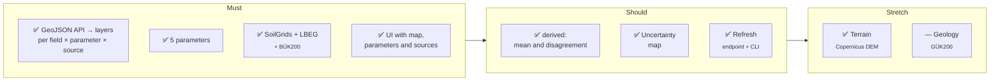

[🇪🇸 Español](../reto.md) · **🇬🇧 English**

# 🎯 Tunen Soil Aggregation API Challenge

> Challenge set by **Tunen** at the **Madrid Open – Vol.1** hackathon (Mad Tech Campus, 3 October 2026).

The original brief and its accompanying data were shared only with participants; this document summarises
what is needed to understand the project.

## What has to be built

A **backend that unifies several German soil data sources behind a single API**,
and a **UI that consumes only that API** (never the sources directly) and paints the data over the fields
of a farm.

Input: a list of GeoJSON polygons (fields). Output: **one raster layer per field × parameter × source**:
- Rendered PNG + bounds (to drop on the map as an image overlay).
- Underlying values (GeoTIFF, or JSON grid + statistics) for hover, legends and comparison.

Shape suggested by the brief (it could be changed if justified; API design was scored):

```
POST /soil/layers
{ "fields": FeatureCollection, "parameters": ["texture","ph","soc","nfk","bodenzahl"],
  "sources": ["soilgrids","lbeg_bk50","lbeg_bodenschaetzung","derived"] }
→ { "fields": [{ "field_id", "bounds", "layers": [{ "parameter","source","unit",
      "png_url","geotiff_url","stats":{min,mean,max}, "colormap":{min,max,name} }] }] }
```

## The five parameters (topsoil 0–30 cm)

| Parameter | Why it matters | Starting sources (brief) |
|---|---|---|
| Texture (clay/sand/silt) | Drainage, tillage, compaction | SoilGrids (%), LBEG BK50 (Bodenart class), Bodenschätzung (Klassenzeichen) |
| pH | Nutrient availability | SoilGrids, OpenLandMap (Earth Engine) |
| Organic carbon | Soil life, water retention | SoilGrids, OpenLandMap |
| nFK (plant-available water) | Water the crop can use | LBEG BK50 (nFKWe), SoilGrids (derived from 33 and 1500 kPa) |
| Bodenzahl | 0–100 score every German farmer knows | LBEG Bodenschätzung (BK50 Ertragsfähigkeit as a proxy) |

Converting **categorical** sources (texture classes, soil types) into comparable values is
"one of the most interesting parts" according to the brief.

## Scope

- **Must:** API that accepts GeoJSON and returns per-source layers for the 5 parameters, from at least
  **SoilGrids + one LBEG source**. UI with a map that toggles parameters and sources.
- **Should:** derived layers (mean and spread across sources), **uncertainty map**, **refresh** mechanism.
- **Stretch:** geology (BGR GÜK200) or terrain (Copernicus DEM: slope, elevation) overlays.

"Derived" must be treated **as just another source** in the API. Adding a new source should be
**a new adapter**, not changes all over the code. Refresh via endpoint, button or CLI.

## Judging criteria

- **Sources:** extensibility; being able to fetch fresh data programmatically; **agronomically well-informed data modelling**.
- **API:** well-defined request/response; interesting derived values (mean, variance…).
- **UI:** several agriculturally interesting visualisations; bonus for complementary datasets; "cool factor".
- **Presentation/live demo:** did it work? was it well communicated? ("everything is won or lost in the presentation").

Rules: live demo of something that actually works (not a stub).

## Starting data

- GeoJSON with 174 fields (87 active, 87 archived) from a real farm in Seggerde (LuF Seggerde).
  Properties: `plotId, fieldName, area, subsidyArea, isArchived`. It is a private dataset shared for the
  hackathon: it is **not published** here, nor is anything derived from it. The screenshots in the
  documentation were taken with it; the repository demo uses a [synthetic farm](../../data/demo/example_farm.geojson)
  with the same format.
- Official notebooks: `soil_api_check.ipynb` (point query), `soil_raster_map.ipynb` (by area).
- Team notebook: `exploracion/soilgrids/Prueba-SoilGrids.ipynb` (VRT raster per plot, 0–30 cm mean weighted by thickness, nFK).

## What was covered



| Brief requirement | How it was solved |
|---|---|
| One layer per field × parameter × source | `POST /soil/layers` returns PNG + JSON grid + statistics + colormap + provenance per layer ([architecture](architecture.md#api)) |
| Categorical sources → comparable values | Deterministic KA5 and Bodenschätzung tables with range and σ ([`lookups/`](../../lookups), [matrix](coverage_matrix.md)) |
| "Derived" as just another source | `derived` adapter: 1/σ² weighted mean, disagreement, conflicts and sampling priority |
| Adding a source = one adapter | Registration with `@register_source` in [`app/sources/`](../../app/sources) |
| Refresh | `POST /refresh`, `GET /refresh` and `python -m app.cli refresh` |
| Uncertainty | Disagreement layer, reliability index, physical contradictions and sampling points ([interface](interface.md#️-uncertainty-and-sampling)) |
| Complementary datasets | BÜK200 for Saxony-Anhalt (where LBEG does not reach) and Copernicus DEM |
| Live demo that works | Pre-warmed disk cache: the farm loaded without network (in the repo, the example farm does too) |

Detail: [architecture.md](architecture.md) and [interface.md](interface.md).
