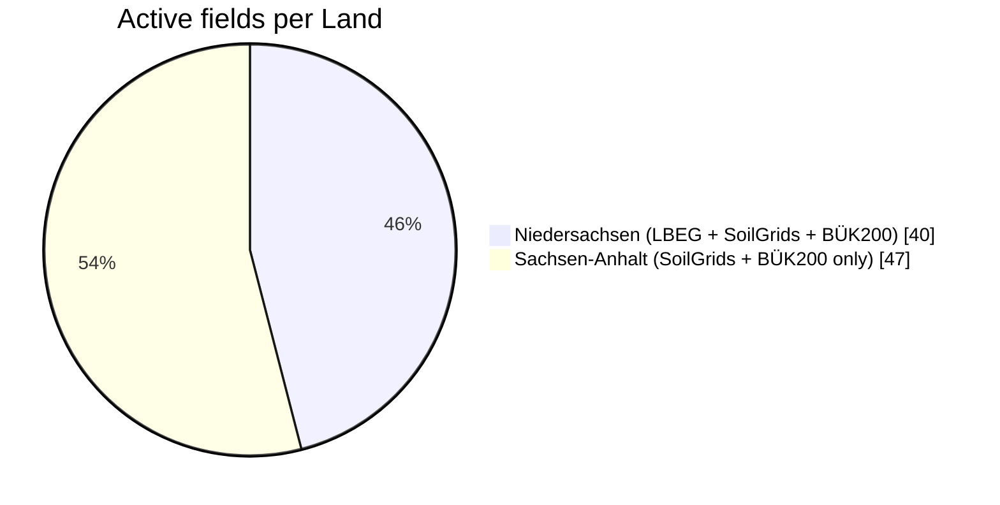

[🇪🇸 Español](../matriz_cobertura.md) · **🇬🇧 English**

# Coverage matrix (parameter × source)

What each source contributes to each parameter, which attribute it comes from and how it is translated to
the common unit. The API exposes a summary in `GET /sources`. All soil parameters refer to the topsoil (0–30 cm).

## At a glance

| | 🌍 SoilGrids | 🏛️ LBEG BK50 | 📜 Bodenschätzung | 🇩🇪 BÜK200 | 🧮 derived |
|---|:---:|:---:|:---:|:---:|:---:|
| **Clay / sand / silt** | 🟢 % | ⚪ | 🟡 class | 🟡 class → % | 🟢 |
| **pH** | 🟢 water | ⚪ | ⚪ | 🟡 CaCl₂ | ⚪ |
| **Organic carbon** | 🟢 | ⚪ | ⚪ | 🟡 humus → C | 🟢 |
| **nFK** | 🟢 | 🟢 | ⚪ | ⚪ | 🟢 |
| **Bodenzahl** | ⚪ | 🟠 proxy | 🟢 | ⚪ | 🟢 |
| **Coverage** | Global | NDS only | NDS only | Germany | Union |

🟢 direct numeric value · 🟡 class translated to a number with a range · 🟠 substitute (proxy) · ⚪ not provided

(NDS = Niedersachsen / Lower Saxony.) The farm is split by the border, so LBEG has no data for half of the fields:

## Matrix

| Parameter | SoilGrids 2.0 | LBEG BK50 | LBEG Bodenschätzung | BGR BÜK200 + FISBo | derived |
|---|---|---|---|---|---|
| **Clay / sand / silt** (%) | `clay`, `sand`, `silt` (g/kg ÷ 10) · 0-5/5-15/15-30 cm weighted to 0–30 · low/high = Q05/Q95 | — (the WMS has no Bodenart) | Class (`KLASSENZEICHEN`: S, Sl, lS…) → range of particles < 0.01 mm (`bodenart_bs`); not converted to clay | KA5 Bodenart of the 0–3 dm horizon → centroid (`ka5_bodenart.csv`); σ = range/√12 + spread across profiles | 1/σ² weighted mean, normalised to 100 % |
| **pH** | `phh2o` ÷ 10 (pH in water) | — | — | KA5 acidity class → midpoint (`ka5_acidez.csv`), **pH in CaCl₂** (not mixed with pH in water) | — |
| **Organic carbon** (g/kg) | `soc` (dg/kg ÷ 10) | — | — | Humus class h0–h7 → % OM → ÷ 1.72 × 10 (`ka5_humus.csv`) | 1/σ² weighted mean |
| **nFK** (mm/dm) | `wv0033` − `wv1500` (WCS); σ = √(σ33² + σ1500²) | `NFKWE` (L839) / (`WE` (L823) / 10); σ = 2 mm/dm (assumed) | — | — | 1/σ² weighted mean |
| **Bodenzahl** (0–100) | — | Proxy: Ertragsfähigkeit BFR 1–7 (L837), own layer | `BODENZ` (int); also `ACKERZ` (string → number) | — | Bodenschätzung value |
| Other layers | — | Soil type (L816), Ertragsfähigkeit | Ackerzahl, Bodenschätzung class | Dominant KA5 class (`ka5_class`) | Disagreement, model σ, `clay_conflict`, sampling priority |
| **Coverage** | Global (urban areas masked) | Niedersachsen only (40 of 87 fields) | Niedersachsen only (gaps in villages and roads) | All of Germany | Wherever any source exists |
| **Resolution** | 250 m | 1:50,000 | 1:5,000 | 1:200,000 (no geometry) | 25 m grid |
| **Latency** | ~0.4 s per WCS coverage (point REST ~35 s, discarded) | ~0.15 s per call, with hangs and 503.2 | Same call as BK50 | ~0.3 s per point + FISBo sheet per unit | No calls |

Copernicus DEM GLO-30 (terrain module) provides elevation, slope, aspect and relief; it is not combined with
the soil sources.

## Types of overlap

- **Same concept, different definition**: texture (SoilGrids splits sand/silt at 50 µm, KA5 at 63 µm; the
  Bodenschätzung talks about "fine particles" < 0.01 mm), nFK (SoilGrids at 33 kPa versus German field
  capacity at pF 1.8 ≈ 6 kPa), pH in water versus pH in CaCl₂.
- **Substitute (proxy)**: Ertragsfähigkeit (BFR 1–7) versus Bodenzahl; KA5 humus versus organic carbon.
- **Different resolution**: SoilGrids 250 m (one field = 1–2 pixels) versus BK50 1:50k, Bodenschätzung 1:5k
  and BÜK200 1:200k.
- **Different coverage**: LBEG only covers Niedersachsen and the farm is split by the border → `no_coverage`
  in Sachsen-Anhalt, where BÜK200 and SoilGrids are the only sources.
- **Non-independent sources**: SoilGrids and OpenLandMap are machine-learning models with similar training
  data (OpenLandMap was not incorporated).

## Detected conflicts

`clay_conflict` flags the points where SoilGrids clay exceeds the maximum fine-particle content allowed by
the Bodenschätzung class (clay is part of those fine particles): a physical inconsistency between sources
that is used to prioritise where to sample.
