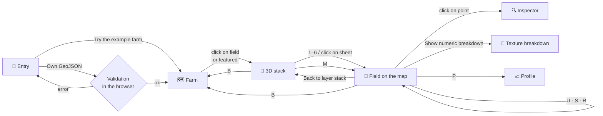
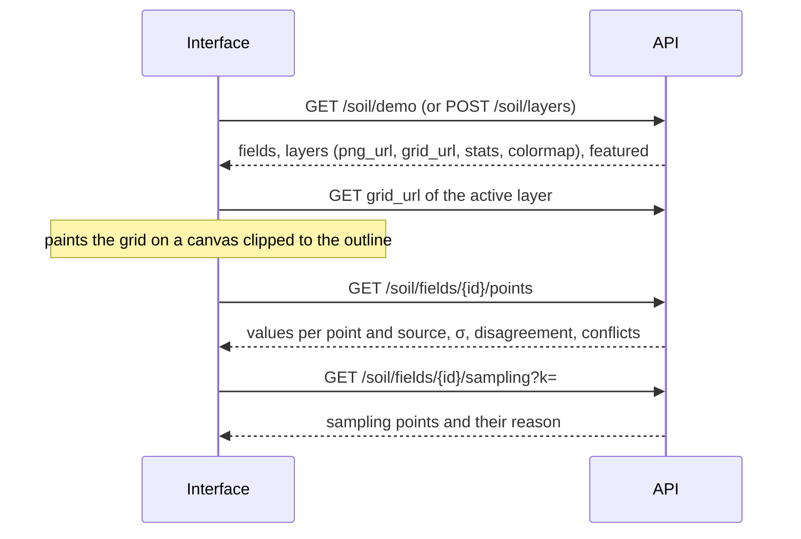

[🇪🇸 Español](../interfaz.md) · **🇬🇧 English**

# 🖥️ The interface

**From a whole farm down to a 25 m point, without losing sight of how much each value can be trusted.**

Landing screen → example farm → the six soil layers of the 87 fields

---

Web application in [`static/`](../../static) (HTML + ES modules + Leaflet, **no build step**), served by the
API itself at <http://localhost:8000>. **It only consumes the API**: it never calls the data sources
directly. The interface text is in English.

## Contents

| | | |
|---|---|---|
| [🚪 Entry](#-entry) | [🗺️ The farm](#️-the-farm) | [🧱 3D layer stack](#-3d-layer-stack) |
| [🔀 Layers and sources](#-layers-and-sources) | [🔍 Per-point inspector](#-per-point-inspector) | [🌡️ Uncertainty and sampling](#️-uncertainty-and-sampling) |
| [🧪 Texture breakdown](#-texture-breakdown) | [⛰️ Terrain](#️-terrain) | [📈 Elevation profile](#-elevation-profile) |
| [⌨️ Keyboard shortcuts](#️-keyboard-shortcuts) | [🧭 Navigation map](#-navigation-map) | [🧩 Modules](#-modules) |

---

## 🚪 Entry

Two paths:

- **Try the example farm** loads the example farm (`GET /soil/demo`), with every response already cached.
  If no example farm is configured, the button is hidden and only upload remains.
- **Drop your own GeoJSON** (or click *browse*), which is sent to `POST /soil/layers`.

The file is validated **in the browser** before sending it. If something does not fit, the message says
exactly what is wrong:

| Problem | What the user sees |
|---|---|
| Broken JSON | *This file is not valid JSON.* |
| Points or lines instead of polygons | *This file contains points or lines, but we need field boundaries (polygons).* |
| Swapped lat/lon coordinates | *Coordinates look swapped or invalid. Expected longitude, latitude.* |
| Server error | Clear message and a button to go back |

While the backend works, a list of steps shows where it is: reading the fields, querying
SoilGrids, LBEG and BÜK200, combining the sources and painting the layers.

| Validation | Progress |
|:---:|:---:|
|  |  |

---

## 🗺️ The farm

The **87 fields** over satellite imagery, painted with the active layer. The header summarises the farm
(fields, Länder and sources with data) and the side panel has:

- the **six soil layers** and the **three terrain layers**, with their number shortcut;
- the **sublayer** and **source** selector for the active layer, and its legend;
- the **featured fields**: the ones most worth opening, because their sources disagree or contradict
  each other physically. There is at least one per Land.

Hovering over a field shows its name and area, and clicking enters it.

> The farm is split by the border between **Lower Saxony** and **Saxony-Anhalt**. The
> *Soil quality* layer (Bodenzahl) only exists in the northern half because it is LBEG data, and LBEG only
> covers Lower Saxony. Those fields appear as *no data*, not as zero.

---

## 🧱 3D layer stack

Entering a field does not go straight to the map: it opens an **isometric stack** with its six layers
clipped to the **real field outline** and the mean value of each one on its label.

- **Hover** over a sheet: it rises and the others dim.
- **Dragging** rotates the stack.
- **Click** on a sheet (or on its row in the panel, or keys <kbd>1</kbd>–<kbd>6</kbd>): the sheet drops to
  the map and that layer opens.
- <kbd>M</kbd> goes straight to the map and <kbd>B</kbd> returns to the farm.

With relief enabled, the base sheet of the stack is the field's hillshade.

---

## 🔀 Layers and sources

Each layer can be viewed **per source**. The layer's JSON grid (`grid_url`) is painted on a canvas with
an agronomic palette, clipped to the field outline, and the value of the cell under the cursor is shown.

| Layer | Sublayers | Sources |
|---|---|---|
| 🟫 **Texture** | Classes · Clay · Sand · Silt | Classes: *Combined* (LBEG Bodenschätzung if the field has it; otherwise BÜK200 KA5 class), LBEG or BÜK200. Percentages: *Combined*, SoilGrids or BÜK200 |
| 💧 **pH** | — | SoilGrids (in water) · BÜK200 (in CaCl₂, estimated from class). They are not mixed |
| 🍂 **Organic carbon** | — | *Combined*, SoilGrids, BÜK200 |
| 🌊 **Plant-available water** (nFK) | — | *Combined*, SoilGrids, LBEG |
| ⭐ **Soil quality** | Bodenzahl · Ackerzahl − Bodenzahl | LBEG (Bodenschätzung) |
| 🛡️ **Reliability** | — | 0–100 index derived from the sampling priority |
| ⛰️ **Relative elevation · Slope · Aspect** | — | Copernicus DEM GLO-30 |

The badge for each source under the field name (SoilGrids, LBEG, BÜK200) shows which ones have data
for that field.

---

## 🔍 Per-point inspector

Moving the cursor shows the active layer's value, and **clicking** opens the inspector
(`GET /soil/fields/{id}/points`), which shows everything known about that 25 m cell:

<table>
<tr>
<td width="55%"></td>
<td>

- **Source × parameter table**: SoilGrids, LBEG, BÜK200 and the **Combined** value. pH carries its method
  (H₂O or CaCl₂).
- **Classes**: the Bodenschätzung class, the KA5 class, the soil type and the parent material.
- **Physical contradiction**, if any. For example, *"SoilGrids reports 14.2 % clay, but the official
  soil assessment class (S) allows at most 10 % fine particles"*.
- **Terrain**: elevation, slope, aspect and Bodenzahl → Ackerzahl.
- The point's **reliability index**, from 0 to 100.

</td>
</tr>
</table>

---

## 🌡️ Uncertainty and sampling

What sets this interface apart: it does not only say what value the soil has, it also says **how much
that value can be trusted**.

| <kbd>U</kbd> · Uncertainty | <kbd>S</kbd> · Sampling points |
|:---:|:---:|
|  |  |
| Overlays the **disagreement between sources** (or, if there is only one, the model σ) on the active layer, normalised with the farm's 98th percentile. The side card gives the reliability index, the mean disagreement and **in which part of the field** it is concentrated. | The points where a **physical sample** is most worth taking, at least 75 m apart and numbered, with the reason in the tooltip (`GET /soil/fields/{id}/sampling`). |

In the farm view, <kbd>S</kbd> shows the sampling points of **every field** at once:

> [!TIP]
> For pH and Bodenzahl the uncertainty between sources is not computed: there are no two comparable
> sources (SoilGrids measures pH in water and BÜK200 in CaCl₂, and Bodenzahl only comes from LBEG).

---

## 🧪 Texture breakdown

In the *Texture* layer, **Show numeric breakdown** opens three panels with **clay, sand and silt** on the
same scale and with the same outline:

- the **cursor is synchronised**: moving it over one panel marks the same point with its value on the other two;
- each panel shows its mean, minimum, maximum and scale;
- **clicking a panel** switches to showing where the sources disagree on that parameter.

---

## ⛰️ Terrain

Optional module based on **Copernicus DEM GLO-30** (disabled with `ENABLE_TERRAIN=0`).

- <kbd>R</kbd> toggles the **hillshade** (with ×3 vertical exaggeration). On the farm it is the background and
  in a field it is blended with the active layer.
- <kbd>7</kbd> <kbd>8</kbd> <kbd>9</kbd>: **relative elevation**, **slope** and **aspect** of each cell.
- The **Field terrain** card summarises the field: elevation range, local relief, mean and p95 slope and
  dominant aspect, with a compass rose. Slope excludes a 40 m strip along the edge,
  because hedges and trees in the surface model inflate the slope.

| Relief on the farm | Relief in a field |
|:---:|:---:|
|  |  |

---

## 📈 Elevation profile

<kbd>P</kbd> (or **Draw elevation profile**) and **two clicks inside the field**:

- draws the A → B line on the map and the **elevation profile** along it, with the distance, the
  relief and the lowest and highest points;
- if the field has Bodenschätzung, it adds the **Bodenzahl along the line** below: you can see whether the
  higher or lower areas have better soil;
- hovering over the chart marks the position on the map;
- stretches that leave the field are shown as gaps, and a click outside the field warns instead of adding a point.

---

## ⌨️ Keyboard shortcuts

The whole demo can be done without a mouse:

| Key | Action |
|:---:|---|
| <kbd>1</kbd> – <kbd>6</kbd> | Soil layers (in the 3D stack: enter that layer) |
| <kbd>7</kbd> – <kbd>9</kbd> | Terrain layers |
| <kbd>U</kbd> | Uncertainty |
| <kbd>S</kbd> | Sampling points |
| <kbd>R</kbd> | Hillshade |
| <kbd>P</kbd> | Elevation profile (in a field) |
| <kbd>M</kbd> | From the 3D stack to the map |
| <kbd>B</kbd> / <kbd>Esc</kbd> | Close the breakdown or the profile; if nothing is open, return to the farm |

---

## 🧭 Navigation map

---

## 🧩 Modules

What each file in <code>static/js/</code> does

| File | Purpose |
|---|---|
| `app.js` | State, navigation between views and shortcuts |
| `api.js` | API calls |
| `catalog.js` | Catalogue of layers, sublayers and sources |
| `map2d.js`, `renderer.js` | Leaflet map and painting of layers clipped to the field |
| `panel.js`, `tooltip.js`, `inspector.js` | Side panel, tooltip and per-point inspector |
| `uncertainty.js` | Uncertainty layer and sampling points |
| `upload.js` | GeoJSON upload and validation |
| `palettes.js` | Palettes and soil class names |
| `stack3d.js`, `texture3.js` | Isometric stack and texture breakdown (loaded dynamically: if they fail, the map keeps working) |
| `terrain.js`, `profile.js` | Relief, terrain layers and elevation profile |

The automated interface checks (Playwright) are in [`tests/ui/`](../../tests/ui/README.md).

[← Back to the README](../../README.en.md)

