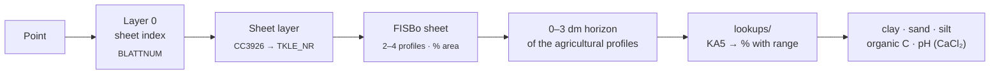

[🇪🇸 Español](../fuentes.md) · **🇬🇧 English**

# Data sources — verified facts

Verified with the scripts in `exploracion/evidencia/` on **3 Oct 2026**. The raw evidence (`exploracion/evidencia/samples/`
and `samples2/`) was generated over the challenge farm's fields and is not published; it can be regenerated with
`python exploracion/evidencia/run_all.py` given that GeoJSON.

## Main finding: the farm crosses the Niedersachsen border

- 87 active fields: **40 in Niedersachsen** (Landkreis Helmstedt, Bahrdorf) and **47 in Sachsen-Anhalt**
  (Börde, Oebisfelde-Weferlingen). Farm bbox: lon 11.025–11.122, lat 52.315–52.390.
- LBEG (BK50 and Bodenschätzung) responds exactly on the NDS fields and returns 0 objects on the
  Sachsen-Anhalt ones (HTTP 200 with `features: []`) → `status = no_coverage`.
- Consequence: for half of the farm **BÜK200** (BGR, national) must be used as the German source.
  It was the backbone of the demo: different resolution and coverage on the same map.

Standard points (`exploracion/evidencia/samples/puntos.txt`):

| id | lon, lat | what it is |
|---|---|---|
| P1 | 9.715, 52.315 | NDS control point from the brief (Hemmingen, Region Hannover) |
| P2 | 11.04118, 52.38258 | field "Umfeld Groß" (31.9 ha), NDS |
| P3 | 11.09105, 52.35035 | field "Mittelbreite" (54.4 ha, the largest), Sachsen-Anhalt |
| P4 | 11.09344, 52.37704 | field "Porzelle" (1.05 ha), Sachsen-Anhalt |

## Summary

| Source | Access | Latency | Main issue | How it was solved |
|---|---|---|---|---|
| 🌍 SoilGrids | WCS 2.0.1 (GeoTIFF per box) | ~0.4 s per coverage | REST ~35 s per point; WCS without nodata (0 = masked) | WCS per field; 0 and −32768 → no coverage |
| 🏛️ LBEG | WMS GetFeatureInfo | ~0.15 s (90 s hangs) | 503.2 inside HTTP 200; NDS only | Body validation, retries, circuit breaker, cache |
| 🇩🇪 BÜK200 | ArcGIS REST + FISBo | ~0.3 s per point | No geometry; data as classes | Legend unit → profiles → KA5 tables |
| 🏔️ Copernicus DEM | STAC → COG on S3 | one read per request | Surface model (hedges, trees) | 40 m strip excluded from the summary |

## ISRIC SoilGrids v2.0 — global, 250 m

- REST: `https://rest.isric.org/soilgrids/v2.0/properties/query?lon&lat&property&depth&value` → JSON.
  **~35 s per call** and rate-limited → not to be used per point in production.
- Units (`/properties/layers`, `d_factor` = divide to get target units):
  clay/sand/silt g/kg ÷10 → %; phh2o pH×10 ÷10; soc dg/kg ÷10 → g/kg; bdod cg/cm³ ÷100 → kg/dm³;
  wv0033/wv1500 (10⁻² cm³/cm³)×10 ÷10 → vol %.
- Statistics: `mean, Q0.05, Q0.5, Q0.95, uncertainty` per depth (0-5, 5-15, 15-30 cm…).
  0–30 cm = mean weighted by thickness (5, 10, 15).
- **Raster**: VRT/COG at `https://files.isric.org/soilgrids/latest/data/{prop}/{prop}_{depth}_{stat}.vrt`
  (CRS Interrupted Goode Homolosine, 250 m, nodata −32768). The farm is ~31×35 pixels.
  Pixel values match the REST exactly (checked at P1 and P3).
- **wv0033 / wv1500 do NOT exist as VRT** (404). They are obtained via **WCS** from
  `https://maps.isric.org/mapserv?map=/map/wv0033.map` (GetCoverage, GeoTIFF, subset in EPSG:4326).
  Careful: the WCS **does not declare nodata** and masked pixels arrive as **0**.
- Covers: texture (numeric), pH, SOC, derived nFK (wv0033 − wv1500) × thickness. Does not cover Bodenzahl.
- Huge uncertainty at some points (P3: clay Q0.05=0.5 % / Q0.95=68 %; SOC mean 53.6 g/kg) →
  justifies the uncertainty map.

## LBEG / NIBIS WMS (PkgId=24) — Niedersachsen only

- `https://nibis.lbeg.de/net3/public/ogc.ashx?PkgId=24&Service=WMS&...`, WMS 1.3.0, 175 layers.
- GetFeatureInfo: formats `application/geo+json` (recommended), `text/plain`, `text/html`.
  Technique: 100×100 m BBOX in EPSG:25832 (E,N order), WIDTH=HEIGHT=101, I=J=50.
- Typical latency **0.15 s**, but **sporadic 90 s hangs** and full service outages
  (one observed on 3 Oct ~15:45) → short timeout (≤20 s), retries and a **mandatory cache**.
- **Saturation: HTTP 200 with the error inside** ("Error 503.2 - Concurrent request limit exceeded", as a `ServiceExceptionReport` XML in geo+json or "Ein Fehler trat beim Abfragen der Ebene…" in text/plain). Checking the HTTP code is not enough: the body must be inspected and the request retried with backoff (`exploracion/evidencia/lbeg.py` and `app/sources/lbeg.py`).
- Outside NDS: HTTP 200 with `features: []` (or "Keine Treffer" in text/plain). The sweep uses text/plain: the "Methode" layers return ~1.3 MB of geometry in geo+json.

### Useful BK50 layers (real attributes)

| Layer | Title | Returned attributes (P1 example) |
|---|---|---|
| L816 | BK50 - Karte | `FL_NR, NRKART, PRONUM, BOTYP=S-L3, BOTYP_KLARTEXT, PSONST, MHGW, MNGW, NUTZUNG=A, GEOTYP=Lol=Lg` — **no Bodenart** |
| L839 | nFKWe | `NFKWE=225` (mm, effective root zone), `NFKWE_STUFE=5` |
| L821 | Pflanzenverfügbares Bodenwasser 1991-2020 | `WPFL=225, WPFLKLASSE=5, WPFLKLASSE_TEXT=hoch` (nFKWe + capillary rise) |
| L823 | Effektive Durchwurzelungstiefe | `WE=110` (cm; converted to dm in the adapter), `WEKLASSE=6`, text |
| L837 | Ertragsfähigkeit | `BFR=7` (1–7 scale, "äußerst gering – äußerst hoch") — Bodenzahl proxy |
| L838 | Grundwasserstufe | `GWS=7` |
| L846 | Kohlenstoffreiche Böden (BHK50) | no objects at P1/P2 (only carbon-rich soils) |

- The **"Methode BK50*" layers (L2081–L2200)** do NOT return values: only a polygon of the method's extent
  (`id, objectid, up_date`). Not useful for pH/Corg/texture.
- **The BK50 in this WMS does not provide texture, pH or Corg** as attributes. The full sweep
  (`exploracion/evidencia/samples/lbeg_bk50/descubrimiento_P1.csv`) shows what each layer returns.
- Converting nFKWe to mm/dm requires WE (L823): `nFK_mm_dm = NFKWE / (WE / 10)`.
- The sweep of 166 queryable layers (P1 and P2) **confirms**: no layer in this WMS provides texture, pH or Corg.
- Other agronomically valuable layers (real attributes in `descubrimiento_P1.csv`), not incorporated:
  L820 compaction sensitivity (`VDST`, `VDST_TEXT`), L822 compaction risk (`VDBF`),
  L1422/L1424 potential additional irrigation need RCP2.6/8.5 (`MBM`, `MIN`, `MAX`, mm),
  L842 infiltration rate (`SWRKLASSE`), L1439/L1440 soil moisture (`BKF`), L829 high-fertility soils,
  L487 BÜK500 (unit text), L58/L29/L848 soil landscapes.

### L849 — Bodenschätzung (BS5, 1:5,000)

- Attributes: `KLASSENZEICHEN` (e.g. `lS3Lo`, `S5D`), `KLASSENZEICHEN_KLARTEXT`
  ("lehmiger Sand/hohe Leistungsfähigkeit/Lössböden mit Diluvialbeimengungen"),
  `KLASSENZEICHEN_SEP` (`lS;3;Lo` → Bodenart; Zustandsstufe; Entstehung),
  **`BODENZ` (int) and `ACKERZ` (a string!)** as separate fields, `AREA`, `UP_DATE`, `TK25`…
- P1: lS3Lo, Bodenzahl 68, Ackerzahl 71. P2 (farm): S5D, Bodenzahl 20, Ackerzahl 21 (poor sand).
- It is the only source with a real Bodenzahl; its Bodenart is also a **third texture source** (class).

## BGR BÜK200 — all of Germany, 1:200,000

- ArcGIS REST `https://services.bgr.de/arcgis/rest/services/boden/buek200/MapServer`.
  Layer 0 = sheet index (`BLATTNUM`); layers 2–56 = one per sheet (farm on **CC3926 Braunschweig**, id 18;
  P1 on CC3918 Hannover, id 17).
- Sheet attributes: `NRKART, TKLE_NR, BGL, LEG_TEXT, Legende, Hinweis, Profile`.
- **`Profile`** = URL to the FISBo sheet (`fisbo.bgr.de/.../getProfile.php?KARTE=BUEK200&LEGNR=<TKLE_NR>`) with
  2–4 profiles per unit, each with **% of area** and horizons with: depth (dm),
  **KA5 Bodenart** (Sl2, Ls4…), **KA5 humus** (h0–h7), carbonate, Ld, **KA5 acidity** (s1…, a1…).
  → BÜK200 provides texture, humus (≈Corg) and pH **as classes** across the whole farm. Data flagged by BGR as
  "vorläufig" (provisional).
- It does not provide nFK or Bodenzahl directly (nFK could be estimated from KA5 + Ld with the KA5 tables).

## Other sources

- OpenLandMap (Earth Engine): pH/SOC; ML model **not independent** from SoilGrids.
- Copernicus DEM GLO-30: incorporated as the terrain module (`app/sources/copernicus_dem.py`).
- Open-Meteo (time-series soil moisture) and BGR GÜK200 (geology): not incorporated.
