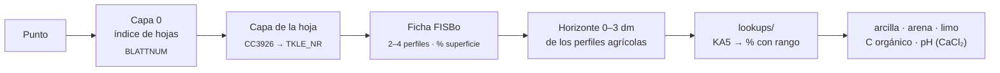

# Fuentes de datos — hechos verificados

Verificado con los scripts de `exploracion/evidencia/` el **3 oct 2026**. La evidencia en bruto (`exploracion/evidencia/samples/`
y `samples2/`) se generó sobre los campos de la granja del reto y no se publica; se regenera con
`python exploracion/evidencia/run_all.py` teniendo ese GeoJSON.

## Hallazgo principal: la granja cruza la frontera de Niedersachsen

- 87 campos activos: **40 en Niedersachsen** (Landkreis Helmstedt, Bahrdorf) y **47 en Sachsen-Anhalt**
  (Börde, Oebisfelde-Weferlingen). bbox granja: lon 11.025–11.122, lat 52.315–52.390.
- LBEG (BK50 y Bodenschätzung) responde exactamente en los campos de NDS y devuelve 0 objetos en los de
  Sachsen-Anhalt (HTTP 200 con `features: []`) → `status = no_coverage`.
- Consecuencia: para la mitad de la granja hay que usar **BÜK200** (BGR, nacional) como fuente alemana.
  Fue el eje de la demo: resolución y cobertura distintas en un mismo mapa.

Puntos estándar (`exploracion/evidencia/samples/puntos.txt`):

| id | lon, lat | qué es |
|---|---|---|
| P1 | 9.715, 52.315 | control NDS del brief (Hemmingen, Region Hannover) |
| P2 | 11.04118, 52.38258 | campo "Umfeld Groß" (31,9 ha), NDS |
| P3 | 11.09105, 52.35035 | campo "Mittelbreite" (54,4 ha, el mayor), Sachsen-Anhalt |
| P4 | 11.09344, 52.37704 | campo "Porzelle" (1,05 ha), Sachsen-Anhalt |

## Resumen

| Fuente | Acceso | Latencia | Problema principal | Cómo se resolvió |
|---|---|---|---|---|
| 🌍 SoilGrids | WCS 2.0.1 (GeoTIFF por caja) | ~0,4 s por cobertura | REST ~35 s por punto; WCS sin nodata (0 = enmascarado) | WCS por campo; 0 y −32768 → sin cobertura |
| 🏛️ LBEG | WMS GetFeatureInfo | ~0,15 s (cuelgues de 90 s) | 503.2 dentro de HTTP 200; solo NDS | Validar cuerpo, reintentos, cortacircuitos, caché |
| 🇩🇪 BÜK200 | ArcGIS REST + FISBo | ~0,3 s por punto | Sin geometría; datos en clases | Unidad de leyenda → perfiles → tablas KA5 |
| 🏔️ Copernicus DEM | STAC → COG en S3 | una lectura por petición | Modelo de superficie (setos, árboles) | Franja de 40 m excluida en el resumen |

## ISRIC SoilGrids v2.0 — global, 250 m

- REST: `https://rest.isric.org/soilgrids/v2.0/properties/query?lon&lat&property&depth&value` → JSON.
  **~35 s por llamada** y límite de uso → no usar por punto en producción.
- Unidades (`/properties/layers`, `d_factor` = dividir para unidades objetivo):
  clay/sand/silt g/kg ÷10 → %; phh2o pH×10 ÷10; soc dg/kg ÷10 → g/kg; bdod cg/cm³ ÷100 → kg/dm³;
  wv0033/wv1500 (10⁻² cm³/cm³)×10 ÷10 → vol %.
- Estadísticos: `mean, Q0.05, Q0.5, Q0.95, uncertainty` por profundidad (0-5, 5-15, 15-30 cm…).
  0–30 cm = media ponderada por espesor (5, 10, 15).
- **Raster**: VRT/COG en `https://files.isric.org/soilgrids/latest/data/{prop}/{prop}_{depth}_{stat}.vrt`
  (CRS Interrupted Goode Homolosine, 250 m, nodata −32768). La granja son ~31×35 píxeles.
  Los valores píxel coinciden exactamente con la REST (comprobado en P1 y P3).
- **wv0033 / wv1500 NO existen como VRT** (404). Se obtienen por **WCS** de
  `https://maps.isric.org/mapserv?map=/map/wv0033.map` (GetCoverage, GeoTIFF, subset en EPSG:4326).
  Ojo: el WCS **no declara nodata** y los píxeles enmascarados llegan como **0**.
- Cubre: textura (numérica), pH, SOC, nFK derivada (wv0033 − wv1500) × espesor. No cubre Bodenzahl.
- Incertidumbre enorme en algunos puntos (P3: clay Q0.05=0,5 % / Q0.95=68 %; SOC media 53,6 g/kg) →
  justifica el mapa de incertidumbre.

## LBEG / NIBIS WMS (PkgId=24) — solo Niedersachsen

- `https://nibis.lbeg.de/net3/public/ogc.ashx?PkgId=24&Service=WMS&...`, WMS 1.3.0, 175 capas.
- GetFeatureInfo: formatos `application/geo+json` (recomendado), `text/plain`, `text/html`.
  Técnica: BBOX 100×100 m en EPSG:25832 (orden E,N), WIDTH=HEIGHT=101, I=J=50.
- Latencia típica **0,15 s**, pero **cuelgues esporádicos de 90 s** y caídas completas del servicio
  (observada una el 3 oct ~15:45) → timeout corto (≤20 s), reintentos y **caché obligatoria**.
- **Saturación: HTTP 200 con el error dentro** ("Error 503.2 - Concurrent request limit exceeded", como `ServiceExceptionReport` XML en geo+json o "Ein Fehler trat beim Abfragen der Ebene…" en text/plain). No basta con mirar el código HTTP: hay que inspeccionar el cuerpo y reintentar con espera (`exploracion/evidencia/lbeg.py` y `app/sources/lbeg.py`).
- Fuera de NDS: HTTP 200 con `features: []` (o "Keine Treffer" en text/plain). El barrido usa text/plain: las capas "Methode" devuelven ~1,3 MB de geometría en geo+json.

### Capas BK50 útiles (atributos reales)

| Capa | Título | Atributos devueltos (ejemplo P1) |
|---|---|---|
| L816 | BK50 - Karte | `FL_NR, NRKART, PRONUM, BOTYP=S-L3, BOTYP_KLARTEXT, PSONST, MHGW, MNGW, NUTZUNG=A, GEOTYP=Lol=Lg` — **sin Bodenart** |
| L839 | nFKWe | `NFKWE=225` (mm, zona radicular efectiva), `NFKWE_STUFE=5` |
| L821 | Pflanzenverfügbares Bodenwasser 1991-2020 | `WPFL=225, WPFLKLASSE=5, WPFLKLASSE_TEXT=hoch` (nFKWe + ascenso capilar) |
| L823 | Effektive Durchwurzelungstiefe | `WE=110` (cm; en el adaptador se pasa a dm), `WEKLASSE=6`, texto |
| L837 | Ertragsfähigkeit | `BFR=7` (escala 1–7, "äußerst gering – äußerst hoch") — proxy de Bodenzahl |
| L838 | Grundwasserstufe | `GWS=7` |
| L846 | Kohlenstoffreiche Böden (BHK50) | sin objetos en P1/P2 (solo suelos ricos en C) |

- Las capas **"Methode BK50*" (L2081–L2200)** NO devuelven valores: solo un polígono de ámbito del método
  (`id, objectid, up_date`). No sirven para pH/Corg/textura.
- **La BK50 en este WMS no da textura, pH ni Corg** como atributo. El barrido completo
  (`exploracion/evidencia/samples/lbeg_bk50/descubrimiento_P1.csv`) dice qué devuelve cada capa.
- Para pasar nFKWe a mm/dm hace falta WE (L823): `nFK_mm_dm = NFKWE / (WE / 10)`.
- El barrido de 166 capas consultables (P1 y P2) **confirma**: ninguna capa de este WMS da textura, pH ni Corg.
- Otras capas con valor agronómico (atributos reales en `descubrimiento_P1.csv`), no incorporadas:
  L820 sensibilidad a compactación (`VDST`, `VDST_TEXT`), L822 riesgo por compactación (`VDBF`),
  L1422/L1424 necesidad potencial de riego adicional RCP2.6/8.5 (`MBM`, `MIN`, `MAX`, mm),
  L842 tasa de infiltración (`SWRKLASSE`), L1439/L1440 humedad del suelo (`BKF`), L829 suelos de alta fertilidad,
  L487 BÜK500 (texto de la unidad), L58/L29/L848 paisajes de suelo.

### L849 — Bodenschätzung (BS5, 1:5.000)

- Atributos: `KLASSENZEICHEN` (p.ej. `lS3Lo`, `S5D`), `KLASSENZEICHEN_KLARTEXT`
  ("lehmiger Sand/hohe Leistungsfähigkeit/Lössböden mit Diluvialbeimengungen"),
  `KLASSENZEICHEN_SEP` (`lS;3;Lo` → Bodenart; Zustandsstufe; Entstehung),
  **`BODENZ` (int) y `ACKERZ` (¡string!)** como campos separados, `AREA`, `UP_DATE`, `TK25`…
- P1: lS3Lo, Bodenzahl 68, Ackerzahl 71. P2 (granja): S5D, Bodenzahl 20, Ackerzahl 21 (arena pobre).
- Es la única fuente con Bodenzahl real; además su Bodenart es una **tercera fuente de textura** (clase).

## BGR BÜK200 — toda Alemania, 1:200.000

- ArcGIS REST `https://services.bgr.de/arcgis/rest/services/boden/buek200/MapServer`.
  Capa 0 = índice de hojas (`BLATTNUM`); capas 2–56 = una por hoja (granja en **CC3926 Braunschweig**, id 18;
  P1 en CC3918 Hannover, id 17).
- Atributos de la hoja: `NRKART, TKLE_NR, BGL, LEG_TEXT, Legende, Hinweis, Profile`.
- **`Profile`** = URL a la ficha FISBo (`fisbo.bgr.de/.../getProfile.php?KARTE=BUEK200&LEGNR=<TKLE_NR>`) con
  2–4 perfiles por unidad, cada uno con **% de superficie** y horizontes con: profundidad (dm),
  **Bodenart KA5** (Sl2, Ls4…), **Humus KA5** (h0–h7), carbonato, Ld, **acidez KA5** (s1…, a1…).
  → BÜK200 da textura, humus (≈Corg) y pH **como clases** en toda la granja. Datos marcados por BGR como
  "vorläufig" (provisionales).
- No da nFK ni Bodenzahl directamente (nFK se podría estimar por KA5 + Ld con tablas de la KA5).

## Otras fuentes

- OpenLandMap (Earth Engine): pH/SOC; modelo ML **no independiente** de SoilGrids.
- Copernicus DEM GLO-30: incorporada como módulo de terreno (`app/sources/copernicus_dem.py`).
- Open-Meteo (humedad del suelo temporal) y BGR GÜK200 (geología): no incorporadas.
