

# 🖥️ La interfaz

**De una granja entera a un punto de 25 m, sin perder de vista cuánto se fía cada dato.**

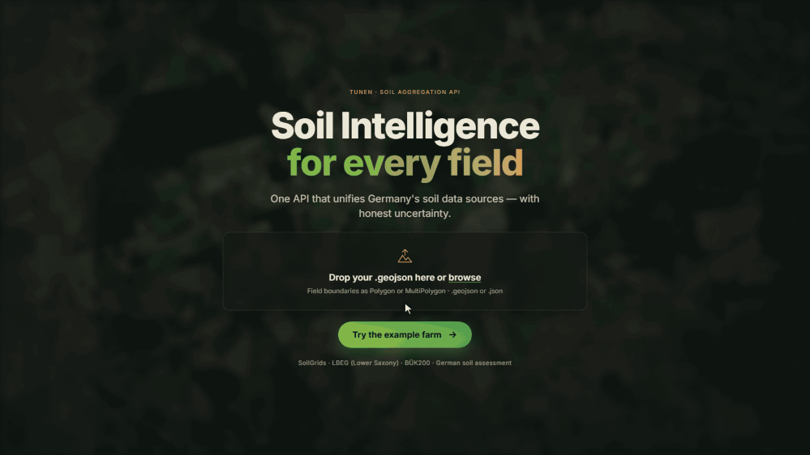

Pantalla inicial → granja de ejemplo → las seis capas de suelo de los 87 campos

---

Aplicación web en [`static/`](../static) (HTML + módulos ES + Leaflet, **sin compilación**), servida por la
propia API en <http://localhost:8000>. **Solo consume la API**: nunca llama a las fuentes de datos
directamente. Los textos de la interfaz están en inglés.

## Índice

| | | |
|---|---|---|
| [🚪 Entrada](#-entrada) | [🗺️ La granja](#️-la-granja) | [🧱 Pila 3D de capas](#-pila-3d-de-capas) |
| [🔀 Capas y fuentes](#-capas-y-fuentes) | [🔍 Inspector por punto](#-inspector-por-punto) | [🌡️ Incertidumbre y muestreo](#️-incertidumbre-y-muestreo) |
| [🧪 Desglose de textura](#-desglose-de-textura) | [⛰️ Terreno](#️-terreno) | [📈 Perfil altimétrico](#-perfil-altimétrico) |
| [⌨️ Atajos de teclado](#️-atajos-de-teclado) | [🧭 Mapa de navegación](#-mapa-de-navegación) | [🧩 Módulos](#-módulos) |

---

## 🚪 Entrada

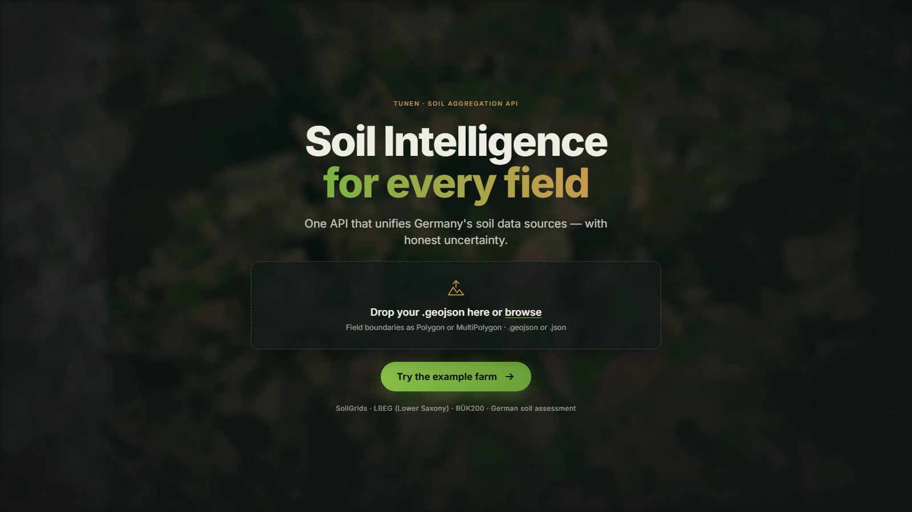

Dos caminos:

- **Try the example farm** carga la granja de ejemplo (`GET /soil/demo`), con todas las respuestas ya en caché.
  Si no hay granja de ejemplo configurada, el botón se oculta y solo queda la subida.
- **Arrastrar un GeoJSON propio** (o pulsar *browse*), que se envía a `POST /soil/layers`.

El archivo se valida **en el navegador** antes de enviarlo. Si algo no encaja, el mensaje dice exactamente
qué pasa:

| Problema | Qué ve el usuario |
|---|---|
| JSON roto | *This file is not valid JSON.* |
| Puntos o líneas en lugar de polígonos | *This file contains points or lines, but we need field boundaries (polygons).* |
| Coordenadas lat/lon invertidas | *Coordinates look swapped or invalid. Expected longitude, latitude.* |
| Error del servidor | Mensaje claro y botón para volver |

Mientras el backend trabaja, una lista de pasos muestra en qué punto está: leer los campos, consultar
SoilGrids, LBEG y BÜK200, combinar las fuentes y pintar las capas.

| Validación | Progreso |
|:---:|:---:|
| 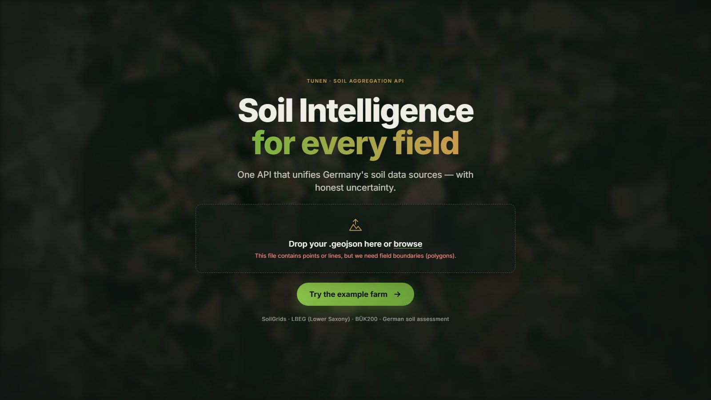 | 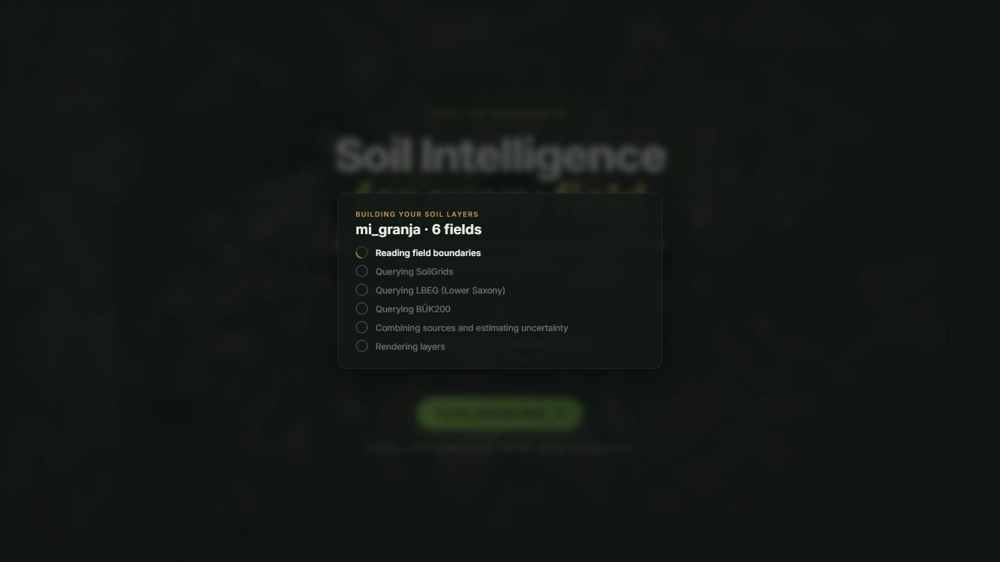 |

---

## 🗺️ La granja

Los **87 campos** sobre imagen de satélite, pintados con la capa activa. La cabecera resume la granja
(campos, Länder y fuentes con datos) y el panel lateral tiene:

- las **seis capas de suelo** y las **tres de terreno**, con su atajo numérico;
- el selector de **subcapa** y de **fuente** de la capa activa, y su leyenda;
- los **campos destacados**: los que más merece la pena abrir, porque sus fuentes discrepan o se
  contradicen físicamente. Hay al menos uno por Land.

Al pasar el ratón por un campo aparece su nombre y su superficie, y al hacer clic se entra en él.

> [!NOTE]
> La granja está partida por la frontera entre **Baja Sajonia** y **Sajonia-Anhalt**. La capa de
> *Soil quality* (Bodenzahl) solo existe en la mitad norte porque es un dato de LBEG, y LBEG solo cubre
> Baja Sajonia. Esos campos aparecen como *no data*, no como cero.

---

## 🧱 Pila 3D de capas

Al entrar en un campo no se va directamente al mapa: se abre una **pila isométrica** con sus seis capas
recortadas con la **silueta real del campo** y el valor medio de cada una en su etiqueta.

- **Hover** sobre una lámina: se eleva y las demás se atenúan.
- **Arrastrar** gira la pila.
- **Clic** en una lámina (o en su fila del panel, o teclas <kbd>1</kbd>–<kbd>6</kbd>): la lámina baja al
  mapa y se abre esa capa.
- <kbd>M</kbd> pasa directamente al mapa y <kbd>B</kbd> vuelve a la granja.

Con el relieve activado, la lámina base de la pila es el relieve sombreado del campo.

---

## 🔀 Capas y fuentes

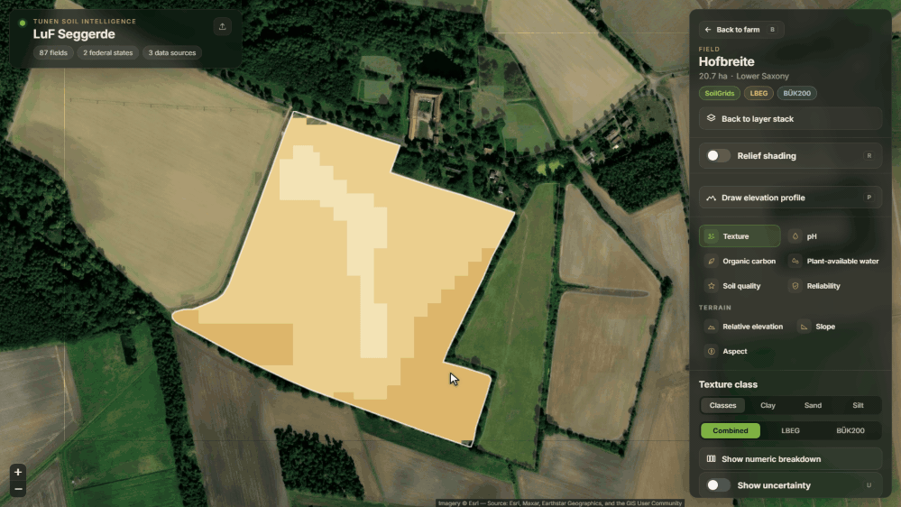

Cada capa se puede ver **por fuente**. La rejilla JSON de la capa (`grid_url`) se pinta en un canvas con
una paleta agronómica, recortada con la silueta del campo, y bajo el cursor aparece el valor de esa celda.

| Capa | Subcapas | Fuentes |
|---|---|---|
| 🟫 **Texture** | Classes · Clay · Sand · Silt | Clases: *Combined* (Bodenschätzung de LBEG si el campo la tiene; si no, clase KA5 de BÜK200), LBEG o BÜK200. Porcentajes: *Combined*, SoilGrids o BÜK200 |
| 💧 **pH** | — | SoilGrids (en agua) · BÜK200 (en CaCl₂, estimado por clase). No se mezclan |
| 🍂 **Organic carbon** | — | *Combined*, SoilGrids, BÜK200 |
| 🌊 **Plant-available water** (nFK) | — | *Combined*, SoilGrids, LBEG |
| ⭐ **Soil quality** | Bodenzahl · Ackerzahl − Bodenzahl | LBEG (Bodenschätzung) |
| 🛡️ **Reliability** | — | Índice 0–100 a partir de la prioridad de muestreo |
| ⛰️ **Relative elevation · Slope · Aspect** | — | Copernicus DEM GLO-30 |

La pastilla de cada fuente bajo el nombre del campo (SoilGrids, LBEG, BÜK200) indica cuáles tienen datos
en ese campo.

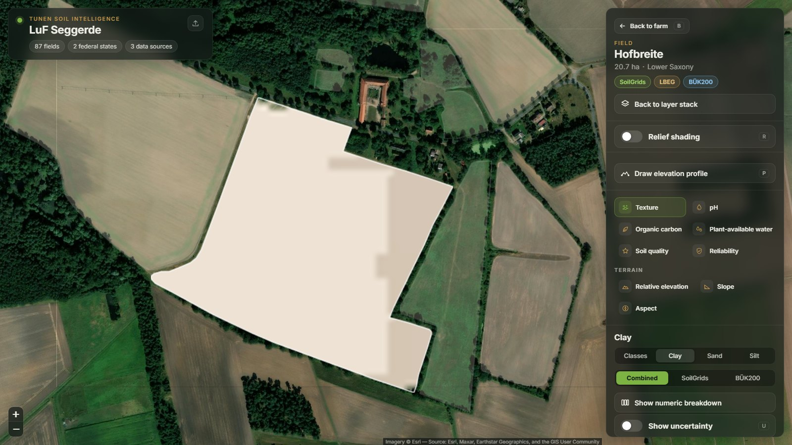

---

## 🔍 Inspector por punto

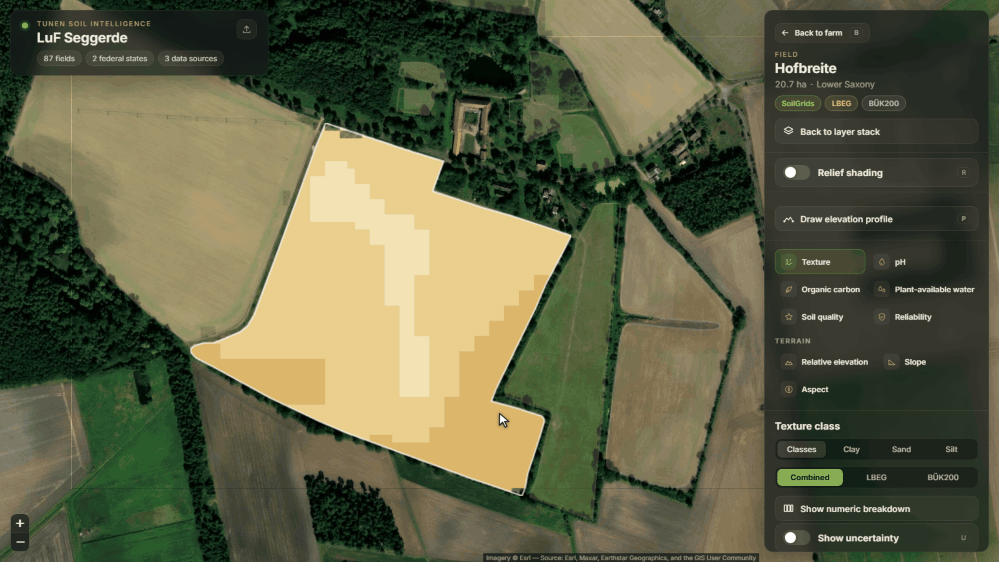

Al mover el cursor se ve el valor de la capa activa, y **al hacer clic** se abre el inspector
(`GET /soil/fields/{id}/points`), que muestra todo lo que se sabe de esa celda de 25 m:

<table>
<tr>
<td width="55%">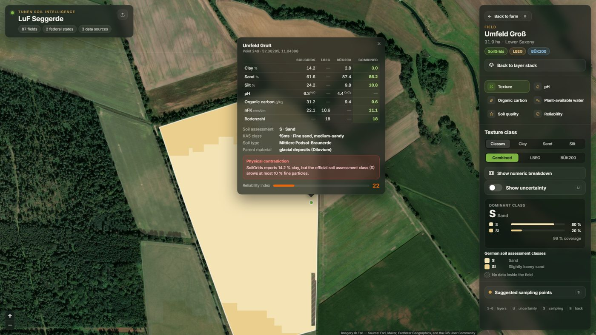</td>
<td>

- **Tabla fuente × parámetro**: SoilGrids, LBEG, BÜK200 y el valor **Combined**. El pH lleva su método
  (H₂O o CaCl₂).
- **Clases**: la clase de la Bodenschätzung, la clase KA5, el tipo de suelo y el material de origen.
- **Contradicción física**, si la hay. Por ejemplo, *"SoilGrids reports 14.2 % clay, but the official
  soil assessment class (S) allows at most 10 % fine particles"*.
- **Terreno**: altitud, pendiente, orientación y Bodenzahl → Ackerzahl.
- **Índice de fiabilidad** del punto, de 0 a 100.

</td>
</tr>
</table>

---

## 🌡️ Incertidumbre y muestreo

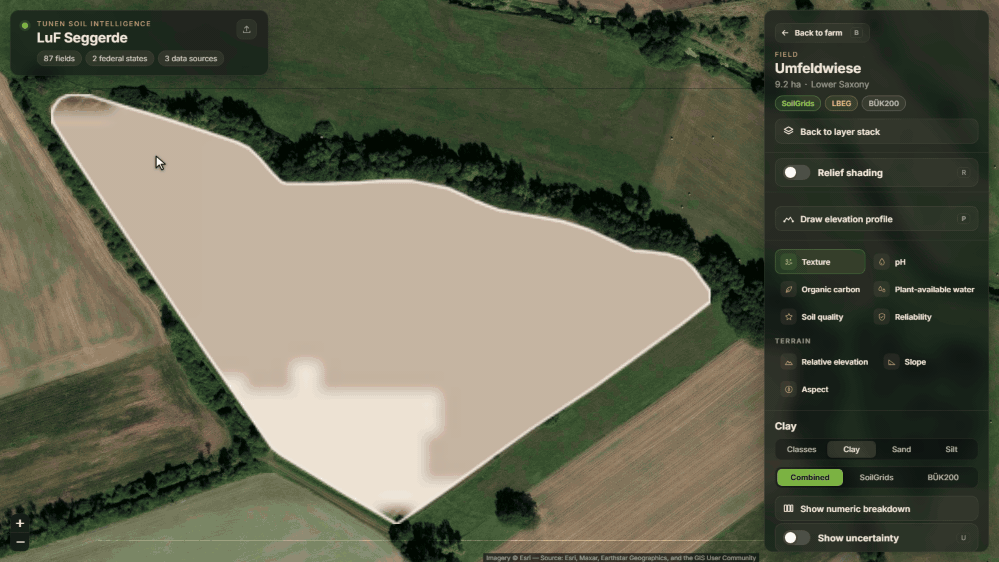

Lo que distingue a esta interfaz: no solo dice qué valor tiene el suelo, también **cuánto se puede
confiar en ese valor**.

| <kbd>U</kbd> · Incertidumbre | <kbd>S</kbd> · Puntos de muestreo |
|:---:|:---:|
| 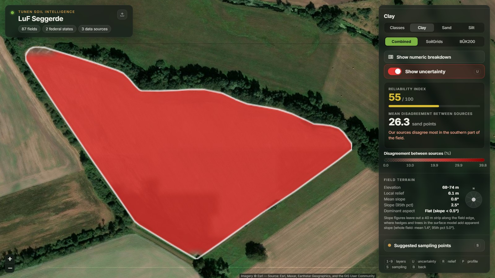 | 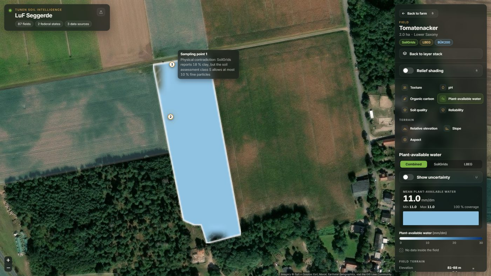 |
| Superpone el **desacuerdo entre fuentes** (o, si solo hay una, la σ del modelo) sobre la capa activa, normalizado con el percentil 98 de la granja. La tarjeta lateral da el índice de fiabilidad, el desacuerdo medio y **en qué parte del campo** se concentra. | Los puntos donde más conviene tomar una **muestra física**, separados al menos 75 m entre sí y numerados, con el motivo en el tooltip (`GET /soil/fields/{id}/sampling`). |

En la vista de granja, <kbd>S</kbd> muestra los puntos de muestreo de **todos los campos** a la vez:

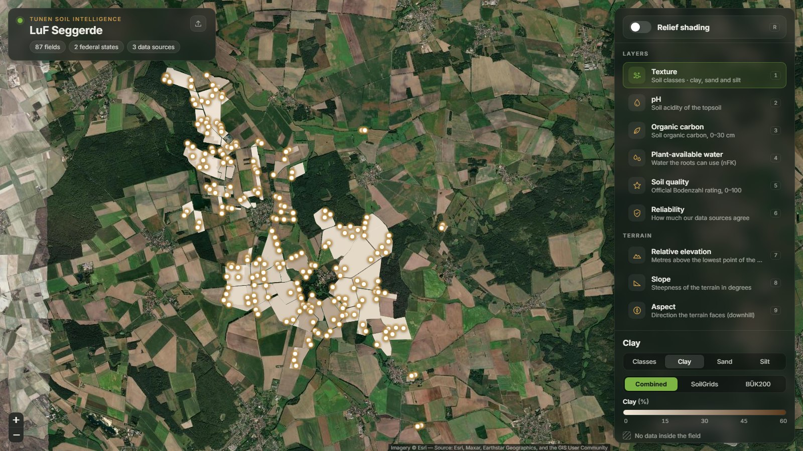

> [!TIP]
> En pH y Bodenzahl no se calcula la incertidumbre entre fuentes: no hay dos fuentes comparables (SoilGrids
> mide el pH en agua y BÜK200 en CaCl₂, y la Bodenzahl solo la da LBEG).

---

## 🧪 Desglose de textura

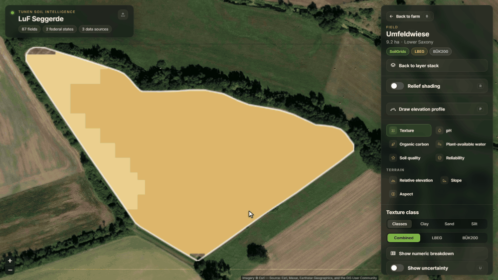

En la capa *Texture*, **Show numeric breakdown** abre tres paneles con **arcilla, arena y limo** a la misma
escala y con la misma silueta:

- el **cursor está sincronizado**: al moverlo por un panel, los otros dos marcan el mismo punto con su valor;
- cada panel muestra su media, mínimo, máximo y escala;
- **al hacer clic en un panel** se pasa a ver dónde discrepan las fuentes en ese parámetro.

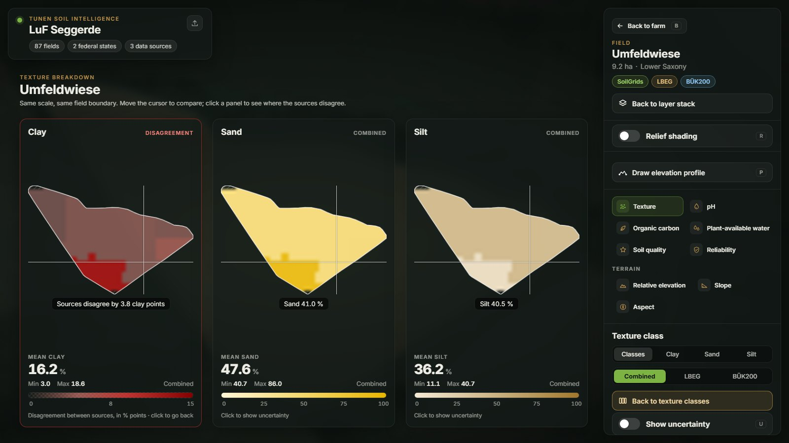

---

## ⛰️ Terreno

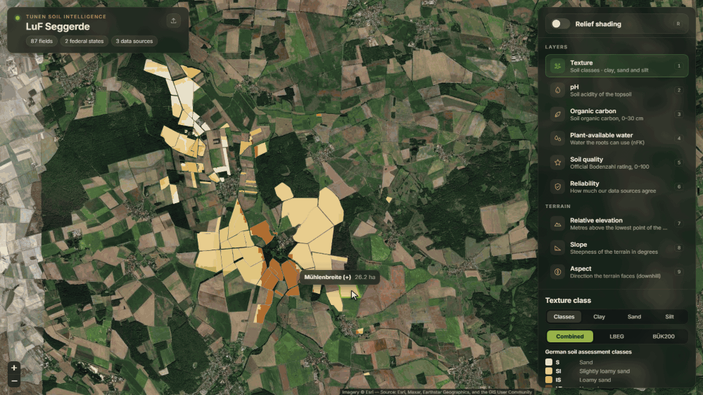

Módulo opcional basado en **Copernicus DEM GLO-30** (se desactiva con `ENABLE_TERRAIN=0`).

- <kbd>R</kbd> activa el **relieve sombreado** (con exageración vertical ×3). En la granja va de fondo y en
  el campo se combina con la capa activa.
- <kbd>7</kbd> <kbd>8</kbd> <kbd>9</kbd>: **altitud relativa**, **pendiente** y **orientación** de cada celda.
- La tarjeta **Field terrain** resume el campo: rango de altitud, relieve local, pendiente media y p95 y
  orientación dominante, con una rosa de los vientos. La pendiente excluye una franja de 40 m del borde,
  porque los setos y los árboles del modelo de superficie inflan la pendiente.

| Relieve en la granja | Relieve en un campo |
|:---:|:---:|
| 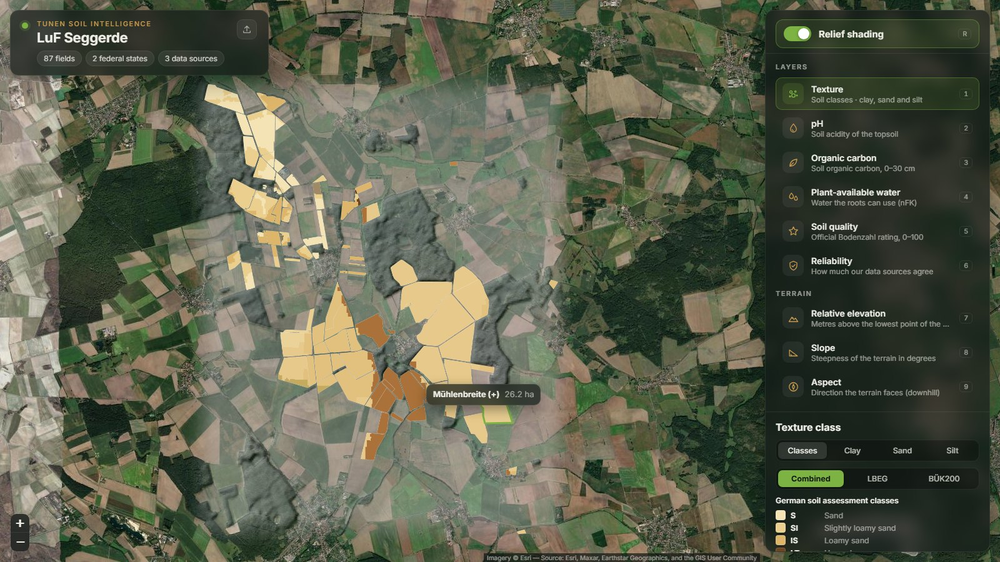 | 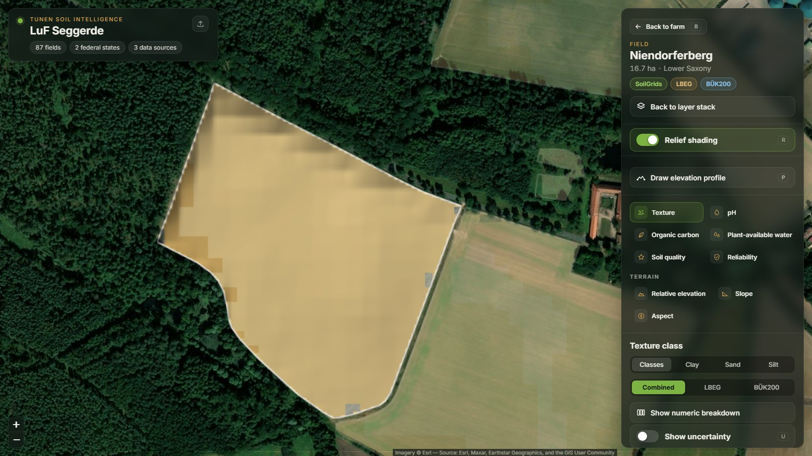 |

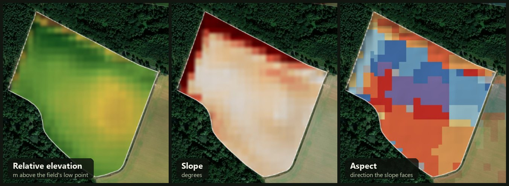

---

## 📈 Perfil altimétrico

<kbd>P</kbd> (o **Draw elevation profile**) y **dos clics dentro del campo**:

- dibuja la línea A → B en el mapa y el **perfil de altitud** a lo largo de ella, con la distancia, el
  relieve y los puntos más bajo y más alto;
- si el campo tiene Bodenschätzung, añade debajo la **Bodenzahl a lo largo de la línea**: se ve si las
  zonas altas o bajas tienen mejor suelo;
- al pasar el cursor por el gráfico se marca la posición en el mapa;
- los tramos que salen del campo quedan como hueco, y un clic fuera del campo avisa en lugar de añadir un punto.

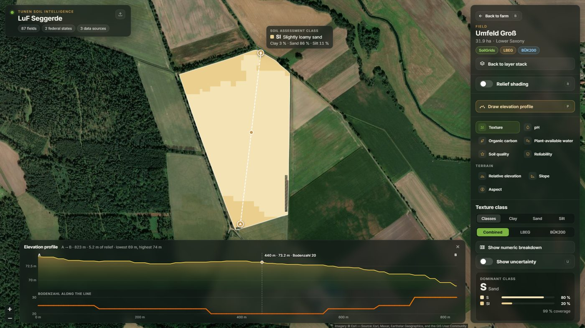

---

## ⌨️ Atajos de teclado

Toda la demo se puede hacer sin ratón:

| Tecla | Acción |
|:---:|---|
| <kbd>1</kbd> – <kbd>6</kbd> | Capas de suelo (en la pila 3D: entrar en esa capa) |
| <kbd>7</kbd> – <kbd>9</kbd> | Capas de terreno |
| <kbd>U</kbd> | Incertidumbre |
| <kbd>S</kbd> | Puntos de muestreo |
| <kbd>R</kbd> | Relieve sombreado |
| <kbd>P</kbd> | Perfil altimétrico (en un campo) |
| <kbd>M</kbd> | De la pila 3D al mapa |
| <kbd>B</kbd> / <kbd>Esc</kbd> | Cerrar el desglose o el perfil; si no hay nada abierto, volver a la granja |

---

## 🧭 Mapa de navegación

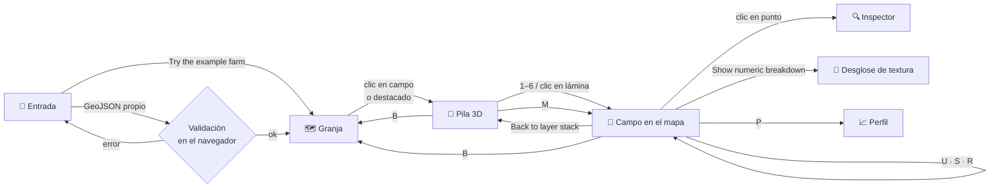
```mermaid
flowchart LR
    L["🚪 Entrada"] -->|Try the example farm| F["🗺️ Granja"]
    L -->|GeoJSON propio| V{"Validación<br/>en el navegador"}
    V -->|ok| F
    V -->|error| L
    F -->|clic en campo<br/>o destacado| S["🧱 Pila 3D"]
    S -->|1–6 / clic en lámina| M["🔀 Campo en el mapa"]
    S -->|M| M
    M -->|clic en punto| I["🔍 Inspector"]
    M -->|Show numeric breakdown| T["🧪 Desglose de textura"]
    M -->|P| P["📈 Perfil"]
    M -->|U · S · R| M
    M -->|Back to layer stack| S
    M & S -->|B| F
```

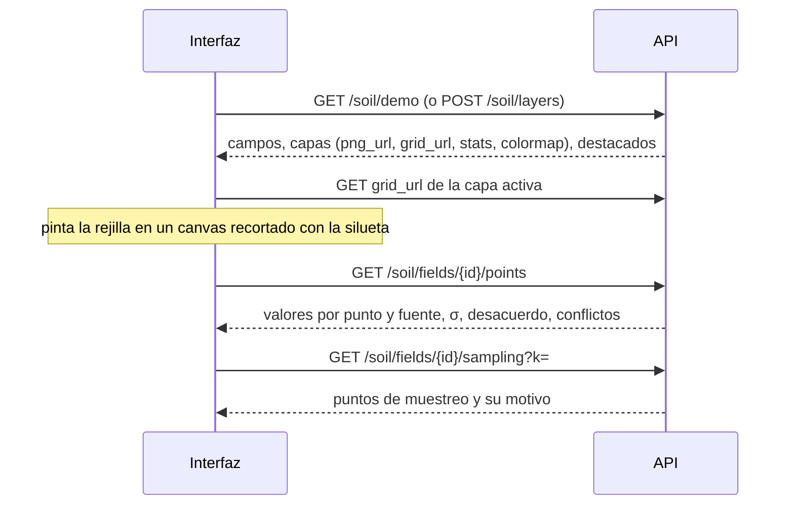
```mermaid
sequenceDiagram
    participant UI as Interfaz
    participant API as API
    UI->>API: GET /soil/demo  (o POST /soil/layers)
    API-->>UI: campos, capas (png_url, grid_url, stats, colormap), destacados
    UI->>API: GET grid_url de la capa activa
    Note over UI: pinta la rejilla en un canvas recortado con la silueta
    UI->>API: GET /soil/fields/{id}/points
    API-->>UI: valores por punto y fuente, σ, desacuerdo, conflictos
    UI->>API: GET /soil/fields/{id}/sampling?k=
    API-->>UI: puntos de muestreo y su motivo
```

---

## 🧩 Módulos

Qué hace cada fichero de <code>static/js/</code>

| Fichero | Función |
|---|---|
| `app.js` | Estado, navegación entre vistas y atajos |
| `api.js` | Llamadas a la API |
| `catalog.js` | Catálogo de capas, subcapas y fuentes |
| `map2d.js`, `renderer.js` | Mapa Leaflet y pintado de las capas recortadas al campo |
| `panel.js`, `tooltip.js`, `inspector.js` | Panel lateral, tooltip e inspector por punto |
| `uncertainty.js` | Capa de incertidumbre y puntos de muestreo |
| `upload.js` | Subida y validación de GeoJSON |
| `palettes.js` | Paletas y nombres de las clases de suelo |
| `stack3d.js`, `texture3.js` | Pila isométrica y desglose de textura (carga dinámica: si fallan, el mapa sigue funcionando) |
| `terrain.js`, `profile.js` | Relieve, capas de terreno y perfil altimétrico |

Las comprobaciones automáticas de la interfaz (Playwright) están en [`tests/ui/`](../tests/ui/README.md).

[← Volver al README](../README.md)

