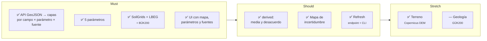

# 🎯 El reto — Tunen Soil Aggregation API

> Reto propuesto por **Tunen** en el hackathon **Madrid Open – Vol.1** (Mad Tech Campus, 3 de octubre de 2026).
> Este proyecto fue el **ganador** del reto.

El enunciado original y los datos que lo acompañaban se compartieron solo con los participantes y no se
publican en este repositorio; este documento resume lo necesario para entender el proyecto.

## Qué hay que construir

Un **backend que unifica varias fuentes de datos de suelo alemanas detrás de una sola API**,
y una **UI que consume solo esa API** (nunca las fuentes directamente) y pinta los datos sobre
los campos de una granja.

Entrada: lista de polígonos GeoJSON (campos). Salida: **una capa raster por campo × parámetro × fuente**:
- PNG renderizado + bounds (para soltarlo en el mapa como image overlay).
- Valores subyacentes (GeoTIFF, o grid JSON + estadísticas) para hover, leyendas y comparar.

Forma sugerida por el enunciado (se podía cambiar si se justificaba; el diseño de la API puntuaba):

```
POST /soil/layers
{ "fields": FeatureCollection, "parameters": ["texture","ph","soc","nfk","bodenzahl"],
  "sources": ["soilgrids","lbeg_bk50","lbeg_bodenschaetzung","derived"] }
→ { "fields": [{ "field_id", "bounds", "layers": [{ "parameter","source","unit",
      "png_url","geotiff_url","stats":{min,mean,max}, "colormap":{min,max,name} }] }] }
```

## Los cinco parámetros (topsoil 0–30 cm)

| Parámetro | Por qué importa | Fuentes de partida (brief) |
|---|---|---|
| Textura (arcilla/arena/limo) | Drenaje, laboreo, compactación | SoilGrids (%), LBEG BK50 (clase Bodenart), Bodenschätzung (Klassenzeichen) |
| pH | Disponibilidad de nutrientes | SoilGrids, OpenLandMap (Earth Engine) |
| Carbono orgánico | Vida del suelo, retención de agua | SoilGrids, OpenLandMap |
| nFK (agua útil) | Agua que el cultivo puede usar | LBEG BK50 (nFKWe), SoilGrids (derivado de 33 y 1500 kPa) |
| Bodenzahl | Puntuación 0–100 que todo agricultor alemán conoce | LBEG Bodenschätzung (BK50 Ertragsfähigkeit como proxy) |

Convertir fuentes **categóricas** (clases de textura, tipos de suelo) en valores comparables es
"una de las partes más interesantes" según el brief.

## Alcance

- **Must:** API que acepta GeoJSON y devuelve capas por fuente para los 5 parámetros, de al menos
  **SoilGrids + una fuente LBEG**. UI con mapa que alterna parámetros y fuentes.
- **Should:** capas derivadas (media y dispersión entre fuentes), **mapa de incertidumbre**, mecanismo de **refresh**.
- **Stretch:** geología (BGR GÜK200) o terreno (Copernicus DEM: pendiente, altitud) superpuestos.

"Derived" debe tratarse **como una fuente más** en la API. Añadir una fuente nueva debería ser
**un adaptador nuevo**, no cambios por todo el código. Refresh vía endpoint, botón o CLI.

## Criterios del jurado

- **Fuentes:** extensibilidad; poder traer datos frescos programáticamente; **modelado de datos bien informado desde la agronomía**.
- **API:** request/response bien definidos; valores derivados interesantes (media, varianza…).
- **UI:** varias visualizaciones interesantes desde el punto de vista agrícola; bonus por datasets complementarios; "cool factor".
- **Presentación/demo en vivo:** ¿funcionó? ¿se comunicó bien? ("todo se gana o se pierde en la presentación").

Reglas: demo en vivo de algo que funcione de verdad (no stub).

## Datos de partida

- GeoJSON con 174 campos (87 activos, 87 archivados) de una granja real en Seggerde (LuF Seggerde).
  Propiedades: `plotId, fieldName, area, subsidyArea, isArchived`. Es un dataset privado compartido para el
  hackathon: **no se publica** aquí, ni tampoco nada derivado de él. Las capturas de la documentación sí se
  hicieron con él; la demo del repositorio usa una [granja sintética](../data/demo/example_farm.geojson) con el
  mismo formato.
- Notebooks oficiales: `soil_api_check.ipynb` (consulta por punto), `soil_raster_map.ipynb` (por área).
- Notebook del equipo: `exploracion/soilgrids/Prueba-SoilGrids.ipynb` (vía raster VRT por parcela, media 0–30 cm ponderada por espesor, nFK).

## Qué se cubrió



| Punto del enunciado | Cómo se resolvió |
|---|---|
| Una capa por campo × parámetro × fuente | `POST /soil/layers` devuelve PNG + rejilla JSON + estadísticas + colormap + procedencia por capa ([arquitectura](arquitectura.md#api)) |
| Fuentes categóricas → valores comparables | Tablas deterministas KA5 y Bodenschätzung con rango y σ ([`lookups/`](../lookups), [matriz](matriz_cobertura.md)) |
| "Derived" como una fuente más | Adaptador `derived`: media ponderada por 1/σ², desacuerdo, conflictos y prioridad de muestreo |
| Añadir una fuente = un adaptador | Registro con `@register_source` en [`app/sources/`](../app/sources) |
| Refresh | `POST /refresh`, `GET /refresh` y `python -m app.cli refresh` |
| Incertidumbre | Capa de desacuerdo, índice de fiabilidad, contradicciones físicas y puntos de muestreo ([interfaz](interfaz.md#️-incertidumbre-y-muestreo)) |
| Datasets complementarios | BÜK200 para Sajonia-Anhalt (donde LBEG no llega) y Copernicus DEM |
| Demo en vivo que funcione | Caché en disco precargada: la granja cargaba sin red (en el repo, la granja de ejemplo también) |

Detalle: [arquitectura.md](arquitectura.md) e [interfaz.md](interfaz.md).
