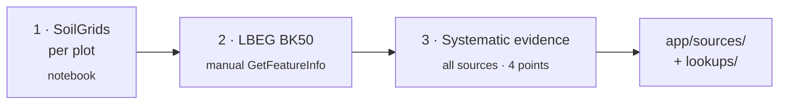

[🇪🇸 Español](README.md) · **🇬🇧 English**

# Exploration

The experiments we ran before building the API, in the order they were done. They are not part of the
product, but the design decisions and the facts in [`docs/en/sources.md`](../docs/en/sources.md) came from here.
File and folder names are in Spanish.

## 1. SoilGrids per plot — `soilgrids/Prueba-SoilGrids.ipynb`

Notebook (Google Colab) that starts by querying the SoilGrids REST API at a point and moves on to reading
ISRIC's VRT raster clipped to each plot: clay, sand, silt, pH and organic carbon, 0–30 cm mean weighted by
thickness and a first nFK estimate.

**Learned**: the REST API takes ~35 s per call and is rate-limited; the raster is the viable route for
whole fields.

## 2. LBEG BK50 — `lbeg-bk50/`

Manual tests of the NIBIS (LBEG) WMS with GetFeatureInfo:

- `test_bk50_getfeatureinfo.py`: three queries on the same point (L816 BK50 Karte, L839 nFKWe,
  L837 Ertragsfähigkeit) with a 100 × 100 m BBOX in EPSG:25832. The responses (`bk50_responses/`) are not published.
- `run_l2186_getfeatureinfo.py`: query of a "Methode BK50" layer (L2186).
- `ogc.xml`: the service's GetCapabilities (175 layers).

**Learned**: the BK50 in this WMS does not include texture, pH or organic carbon; the "Methode" layers only
return the method's extent, not values; the Bodenschätzung does provide Bodenzahl and Klassenzeichen.

## 3. Systematic evidence — `evidencia/`

Scripts that query every source at the same four points and store the raw responses
(`samples/`), plus a second round of checks aimed at the backend design (`samples2/`).
Those responses were obtained over the challenge farm's fields and are not published; the scripts are.
Detail in [`evidencia/README.md`](evidencia/README.md) (Spanish).

**Learned**:

- The farm crosses the border: LBEG only covers the 40 fields in Niedersachsen; the 47 in
  Sachsen-Anhalt needed BÜK200.
- LBEG returns `503.2` errors inside HTTP 200 responses and has long hangs → disk cache,
  body validation and retries.
- A single GetFeatureInfo call can request several layers, and each returned polygon covers many grid
  points ("harvest"), cutting the number of calls to a fraction.
- BÜK200 returns no geometry: one value per legend unit, with FISBo profiles to get the KA5 classes.
- SoilGrids `wv0033`/`wv1500` do not exist as VRT: only via WCS.

With all this the adapters in `app/sources/` and the tables in `lookups/` were designed.

Script paths are relative to their own folder or to the repository root; they are run from the
root with the dependencies in `requirements.txt`.
